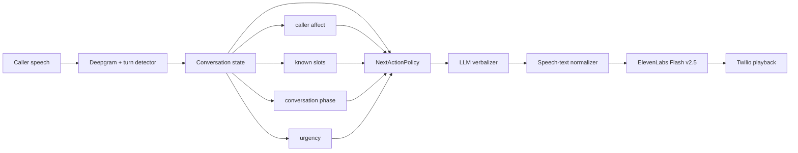
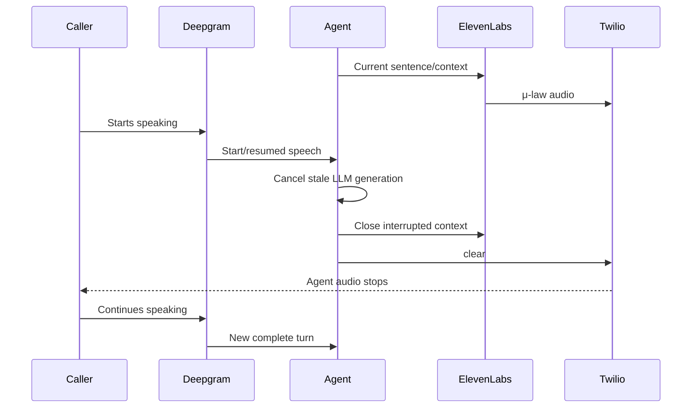
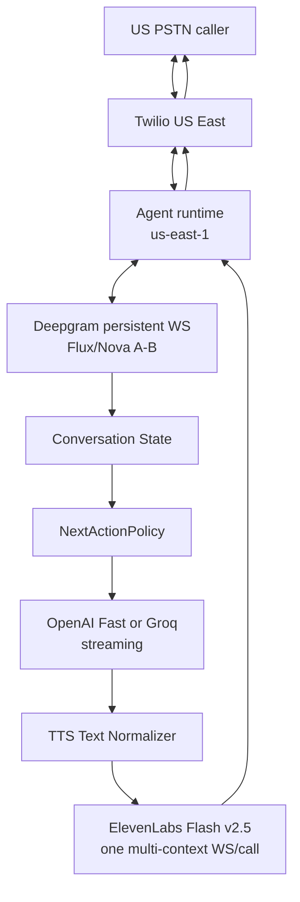

# Human-Like Enterprise Voice Agents: Applied Research for the Twilio–Deepgram–OpenAI/Groq–ElevenLabs Stack

## Executive Summary

The central finding is that **a human-sounding phone agent is not primarily created by adding “ums,” choosing a warmer voice, or increasing TTS expressiveness**. Human-likeness emerges from a coordinated system of **turn timing, linguistic economy, contingent acknowledgement, prosodic variation, emotional adaptation, conversational memory, interruption behavior, and task competence**. Research on human dialogue shows that turn transitions are normally extremely tight, often around the 0–200 ms range, while research on spoken agents finds that long fixed end-of-turn waits make systems feel sluggish. Backchannels help when their *timing and meaning are appropriate*, not merely because they exist. citeturn3search11turn5search7turn20search6

That distinction matters directly for your agent. Your current stack is already technically capable of good conversational speech:

```text
Twilio Media Streams
        ↓
Deepgram
        ↓
OpenAI / Groq
        ↓
ElevenLabs Flash v2.5
        ↓
Twilio μ-law 8 kHz
```

The current production problem is not that any one of these providers is incapable of natural output. Your own call evidence shows repetitive, interview-like dialogue such as asking the caller for a service *and* date/time together, followed by repeated template-like closings. Your current ElevenLabs settings are `stability=0.5` and `similarity_boost=0.75`, which are already very close to ElevenLabs' own common starting settings; therefore **changing sliders alone is unlikely to cure the robotic feel**. fileciteturn0file1 citeturn19view0

The previous speed work also changes the design space. Your repo now has native Groq streaming, shared connection pools, and OpenAI Fast tier; the benchmark in your latest engineering notes measured OpenAI on the real prompt at about **1,534 ms TTFT before Fast versus 772 ms with Fast**. fileciteturn0file0 That means the next humanness layer should be built around **first-useful-sentence latency**, not total response generation. A receptionist should usually decide and verbalize only the *next conversational move*, not generate a paragraph and then speak it.

My recommended architecture is therefore:



The key design decision is the **NextActionPolicy** between understanding and language generation. The LLM should generally not be asked simultaneously to figure out business state, choose the next operation, maintain compliance, decide whether a tool is needed, determine emotional strategy, and improvise beautiful speech. Enterprise contact-center platforms increasingly separate conversation analysis, sentiment, next-best-action guidance, policy, and response execution for exactly this reason. citeturn17search5turn17search10

For your stack, the highest-impact sequence is:

| Priority | Change | Expected humanness effect | Latency effect | Confidence |
|---|---|---:|---:|---|
| **First** | Short-turn prompt + NextActionPolicy + caller-state scaffolding | **Very high** | Positive | Very high |
| **Second** | Replace generic stock “corporate” voice with a deliberately recorded conversational IVC candidate; A/B voice before tuning sliders | **Very high** | Neutral to small | High |
| **Third** | Human turn-taking: Flux/EOT testing, hard barge-in, persistent ElevenLabs multi-context WS | **Very high** | **High positive** | Very high |
| Then | Prosodic text normalization: punctuation, brief pauses, spoken-form dates/numbers | High | Neutral | High |
| Then | Sparse, state-dependent acknowledgements/backchannels | Medium–high | Neutral | High |
| Then | Fine tuning stability/speed/similarity | Medium | Neutral | Medium–high |
| Avoid | Random `um`, `uh`, fake stutters, fake breaths | Often negative | Can increase latency | High |
| Avoid | `style > 0` merely to sound “more human” | Uncertain/negative | Can increase latency | High |

The most important conceptual rule is:

> **Optimize for “a skilled real receptionist,” not “a model trying to demonstrate that it is human.”**

Task-oriented studies have found that indiscriminately adding fillers such as “um” and “uh” can make conversational agents seem **less intelligent or likable without significantly improving perceived human-likeness**. A larger experiment on contextualized fillers found they can improve *perceived waiting time*, but that is different from improving basic likeability. citeturn4search1turn4search0

So the system should use:

> “Yeah, absolutely. What day were you thinking?”

much more often than:

> “Um, yeah, absolutely, so, uh, what day were you thinking?”

And during a real lookup:

> “Yeah, I can check that.”

is better than either silence or:

> “Hmm... let me think... one moment while I process your request.”

OpenAI's current voice-agent prompting guidance independently makes essentially the same distinction: brief spoken preambles are useful before noticeable tool work, but it recommends keeping them short, varying them, and avoiding generic thinking/filler phrases. citeturn15view1


## What Actually Makes a Voice Agent Feel Human

Human-likeness is best treated as a layered interaction property rather than an audio property. Professional call-center agents and conversational-speech researchers converge on several of the same behaviors: **listen without premature interruption, acknowledge what was actually said, adapt to the caller's emotional state, keep the exchange moving, and modulate tone/pacing according to context**. NiCE's current call-center guidance explicitly recommends tone and pace matching, slowing and softening for upset or confused callers, active listening, paraphrasing, clarifying rather than assuming, and not mirroring an angry caller's frustration. citeturn17search0turn17search1turn17search2turn17search3

| Attribute | What humans perceive | What your agent should do | What makes it robotic |
|---|---|---|---|
| **Turn timing** | Responsiveness, attention | React quickly after a real turn completion | Fixed 800–1,500 ms silence on every turn |
| **Turn yielding** | “She’s done; now it’s my turn” | Finish questions cleanly and stop | Long trailing monologues |
| **Prosody** | Intent, confidence, warmth, emotion | Vary phrase contour through wording, punctuation and voice choice | Same cadence every sentence |
| **Brevity** | Competence and conversational rhythm | Usually one conversational move per turn | Answer + explanation + three questions |
| **Acknowledgement** | “She heard me” | Acknowledge the *meaning*, then proceed | “Got it!” after everything |
| **Backchanneling** | Attentive listening | Sparse “yeah,” “right,” “okay” when semantically/timing appropriate | Constant “uh-huh” injection |
| **Lexical register** | Social fit | Contractions, everyday words, caller-compatible formality | Written corporate prose |
| **Empathy** | Recognition of emotional state | Name the concrete inconvenience/pain once, then help | Repeated “I completely understand” |
| **Entrainment** | Conversational alignment | Mildly adapt pace, energy, directness and formality | Identical style for every caller |
| **Disfluency** | Spontaneity *when meaningful* | Rare hesitation around genuine uncertainty | Artificial `um/uh` everywhere |
| **Competence** | Trust | Remember information and act on it | Asking again for known information |
| **Barge-in behavior** | Social awareness | Stop immediately when caller takes the floor | Continue talking over caller |

### Timing matters as much as voice quality

Cross-linguistic studies of human turn-taking found that ordinary conversation strongly concentrates turn transitions around small gaps rather than multi-second delays. Modern spoken-dialogue work similarly treats accurate end-of-turn prediction, interruption handling and overlapping/backchannel behavior as central to human-like interaction. citeturn3search11turn20search8turn20search10

This does **not** mean a cascaded production system must literally achieve a 100 ms answer. It means you should avoid voluntarily adding latency in an attempt to simulate a “thoughtful human pause.” Your current pipeline already has network, endpointing, model, synthesis and playout delays. fileciteturn0file0

For your agent:

```text
BAD

caller stops
   ↓
endpoint delay
   ↓
LLM delay
   ↓
extra artificial "human" delay
   ↓
TTS
   ↓
speech


BETTER

caller reaches probable end-of-turn
   ↓
begin speculative/streamed reasoning
   ↓
first meaningful complete sentence
   ↓
TTS immediately
   ↓
natural micro-pauses INSIDE the spoken response
```

Deepgram Flux is particularly relevant because it was designed for conversational turn detection and exposes states such as early/eager end-of-turn and resumed speech, allowing an application to start computation speculatively and cancel it when the user continues. Deepgram recommends approximately 80 ms audio chunks for Flux and reports roughly 260 ms median end-of-turn behavior under its documented default configuration. citeturn0search13turn0search2

### Backchannels should communicate information, not decorate speech

Backchannels such as “yeah,” “oh,” and “right” are valuable because they signal attention and understanding without claiming the conversational floor. Research increasingly treats both **timing and backchannel type** as prediction problems; acoustic cues including speaking duration, intensity and fundamental frequency help predict when they belong. citeturn20search1turn20search6

For a telephony cascade, however, I would initially separate two kinds:

| Type | Example | Recommendation |
|---|---|---|
| **Post-turn acknowledgement** | “Yeah, absolutely.” | Use now |
| **Semantic reflection** | “Okay, so Thursday afternoon.” | Use now |
| **Tool-delay acknowledgement** | “I’ll pull up the afternoon openings.” | Use now |
| **Mid-user-speech backchannel** | “Mm-hm” while caller is speaking | Defer until duplex/barge-in is robust |
| **Random filler** | “Um... uh... yeah...” | Avoid |

Mid-speech backchannels can be highly human, but they are much harder than simply generating a sound: timing errors cause the agent to sound as though it is interrupting. Contemporary research explicitly models backchannel timing from acoustic and linguistic signals rather than inserting them on a timer. citeturn20search6turn20search8

### Mirroring should be bounded

Prosodic entrainment—conversation partners partially adapting acoustic/prosodic behavior to each other—is a documented phenomenon in human dialogue and has been studied as a mechanism for more natural conversational systems. citeturn5search1turn20search7

But enterprise agents should **mirror social style, not dysfunction**. NiCE similarly recommends matching caller tone and pace for rapport while specifically warning agents not to mirror anger or frustration. citeturn17search2turn17search3

A useful runtime policy is:

| Caller | Agent adaptation |
|---|---|
| Fast, busy | Shorter answers, fewer acknowledgements, faster transition |
| Relaxed/chatty | Slightly more warmth and optional small talk |
| Formal | Reduce slang; use “certainly/yes” rather than “yep/gotcha” |
| Casual | Contractions, “yeah,” “gotcha” occasionally |
| Confused | Slower phrasing, one fact/question at a time |
| Frustrated | Lower energy, no cheerleading, acknowledge once, act |
| Emergency/urgent | Remove fillers and banter; calm, direct, procedural |
| Elderly/hearing difficulty | Short clauses, slightly slower delivery, explicit confirmation |
| Repeated correction | Drop social fluff; apologize briefly and repair |

The key is **moderate adaptation**, not caricature.

### Disfluency is not a humanness shortcut

Spontaneous human speech does include filled pauses, prolongations and hesitation, and speech-synthesis research has explored controlling these behaviors. citeturn20search4turn20search7 But user-facing studies show that simply adding fillers to a task agent does not guarantee increased human-likeness and can lower perceived intelligence or likability. citeturn4search1

For this receptionist I recommend this policy:

**Allowed occasionally**

```text
"Well, the earliest one I have is Tuesday."
"Yeah — that should work."
"Okay, so Thursday afternoon."
"Actually, we do have one at three thirty."
```

**Allowed only for genuine recovery**

```text
"Sorry — did you say Thursday or Tuesday?"
```

**Usually banned**

```text
um
uh
uhh
erm
like, like
you know
I guess
I think maybe
```

**Completely banned in**

```text
booking confirmation
phone-number readback
financial amounts
emergency instructions
compliance language
identity verification
tool-result confirmation
```

This is closer to professional human speech: *occasional spontaneity inside an otherwise competent interaction*.


## Prompt and Business-Logic Scaffolding

Your present prompt is doing too many jobs. The project brief describes a roughly 426-line clinic prompt with numerous load-bearing sections for identity, dates, tool behavior, confirmation, phone handling, compliance and hallucination prevention; those rules should remain intact while the conversational layer is simplified. fileciteturn0file1

OpenAI's current voice prompting guide recommends short labeled sections, bullets rather than long prose, explicit examples, precise non-conflicting instructions, explicit verbosity guidance, and variety constraints to prevent repeated acknowledgements and openings. citeturn15view0turn15view1turn15view2

The important architectural improvement is to **stop encoding business policy only as natural-language personality instructions**.

Instead:

```text
          BUSINESS LOGIC                            LANGUAGE
┌─────────────────────────────┐         ┌──────────────────────────────┐
│ What is happening?          │         │ How should this sound?       │
│                             │         │                              │
│ intent                      │         │ brief                        │
│ slots                       │───────► │ warm                         │
│ caller mood                 │         │ conversational               │
│ urgency                     │         │ context-sensitive            │
│ tool needed?                │         │ voice-friendly text          │
│ next action                 │         │ one question                 │
│ confirmation required?      │         │                              │
│ escalation required?        │         └──────────────────────────────┘
└─────────────────────────────┘
```

This resembles the separation used in modern contact-center systems, where real-time sentiment/intent analysis feeds next-best-action guidance instead of forcing an agent to reason from scratch about every interaction. citeturn17search5turn17search10

A practical state object for your repo could be:

```json
{
  "conversation_phase": "slot_collection",
  "speech_act": "ask_preference",
  "caller_affect": "neutral",
  "caller_style": "casual",
  "urgency": "routine",
  "next_action": "ask_time_of_day",
  "known": {
    "service": "cleaning",
    "date_window": "next_week"
  },
  "missing": [
    "time_of_day"
  ],
  "tool_pending": false,
  "requires_confirmation": false
}
```

The LLM's job then becomes:

```text
VERBALIZE next_action naturally,
using caller_affect and caller_style,
without inventing or changing business state.
```

That is far easier to make reliable and human.

### Recommended live prompt scaffold

The following is the prompt shape I would use around your existing load-bearing business rules:

```text
# ROLE

You are Alex, the front-desk receptionist at {{business_name}}.
You sound like a capable real person speaking on the phone: warm,
relaxed, concise, attentive, and never theatrical.

# CONVERSATION CONTRACT

- Speak, don't write.
- Usually say 6–24 words.
- Usually make ONE conversational move per turn.
- Ask at most ONE question at a time.
- Stop once the caller has an obvious next thing to say.
- Use contractions naturally.
- Prefer ordinary spoken English over formal customer-service wording.
- Never repeat information the caller already gave you.

# LISTENING

Before replying, identify what the caller actually contributed.

When useful:
- acknowledge it briefly;
- reflect the important detail;
- then take the next action.

Do not acknowledge every turn.

Examples of acknowledgements:
"Yeah."
"Okay."
"Gotcha."
"Absolutely."
"Right."
"That makes sense."

Vary them. Do not use the same opener twice in nearby turns.

# ADAPTIVE DELIVERY

Caller affect: {{caller_affect}}
Caller style: {{caller_style}}
Urgency: {{urgency}}

- Busy → shorter, direct.
- Casual → relaxed contractions.
- Formal → slightly more professional.
- Confused → slower, simpler, one idea at a time.
- Frustrated → calm, low-energy, acknowledge once, then solve.
- Urgent → no banter, filler, or unnecessary acknowledgements.

Never mirror anger.

# DISFLUENCIES

Do not add random "um", "uh", fake stutters, fake breathing, or
hesitation to sound human.

A mild discourse marker such as "well", "actually", or "so" is
allowed only when it has a conversational purpose.

# VARIETY

Do not mechanically begin replies with:
"Of course", "Absolutely", "Got it", or "I understand".

Vary acknowledgement, sentence structure, and question wording.

# CURRENT CONVERSATION STATE

Phase: {{conversation_phase}}
Next action: {{next_action}}
Known information: {{known_slots}}
Missing information: {{missing_slots}}
Tool pending: {{tool_pending}}

Perform the NEXT ACTION only.
Do not jump ahead and interview the caller for later fields.

# TTS WRITING

Write exactly what should be spoken.

- Normalize dates, times, phone numbers, currencies and abbreviations
  into natural spoken form when they will be read aloud.
- Prefer short natural sentences.
- Use an em dash only for a genuine short conversational pause.
- Use ellipses only for genuine hesitation.
- No markdown.
- No stage directions.
- No emojis.
```

The final TTS-normalization rules are particularly important with Flash v2.5. ElevenLabs explicitly documents that smaller Flash models can mishandle numbers, dates, times, addresses and abbreviations and recommends converting model output into explicit spoken forms before synthesis. citeturn18view0

### Response budgets should depend on the speech act

“Be concise” is too vague. OpenAI's voice-agent guidance explicitly recommends defining response length by task type and asking clarifying questions one at a time. citeturn15view1

For this agent I would impose application-side limits like these:

| Speech act | Normal words | Suggested output cap | Typical form |
|---|---:|---:|---|
| Acknowledge | 2–8 | ~20 tokens | “Yeah, absolutely.” |
| Clarify | 5–18 | ~32 tokens | “Sorry — did you say Tuesday or Thursday?” |
| Ask next slot | 6–20 | ~40 tokens | “Gotcha. Do mornings or afternoons usually work better?” |
| Tool preamble | 5–14 | ~32 tokens | “I’ll pull up the afternoon openings.” |
| Direct answer | 8–25 | ~48 tokens | Answer + optional next question |
| Booking proposal | 12–30 | ~64 tokens | Slot + one question |
| Final confirmation | 15–35 | ~80 tokens | Explicit factual readback |
| Complex explanation | 20–50 | ~120 tokens | Only when genuinely needed |
| Emergency/escalation | Policy-dependent | ~96 tokens | Approved safety language |

These caps are an engineering recommendation rather than provider requirements. The point is to prevent the LLM from using a 300-token allowance merely because one is available.

Both GPT-4o-mini and Groq's current GPT-OSS-class models expose very large context windows relative to an ordinary receptionist call, but capacity should not be treated as permission to put the entire conversation transcript and every policy into every active decision. GPT-4o-mini documents a 128k-token context window, while Groq documents 131,072 tokens for GPT-OSS 20B. citeturn11search0turn11search3

A better runtime context strategy is:

| Context component | Recommended live budget |
|---|---:|
| Persona + conversational contract | ~400–700 tokens |
| Dynamic business/tenant essentials | As needed |
| Load-bearing business/tool rules | Preserve, then deduplicate |
| Few-shot conversational examples | ~300–500 tokens |
| Current state object | ~100–250 tokens |
| Recent verbatim conversation | ~6–10 turns |
| Older conversation | State summary, not raw transcript |
| Current utterance | Full |
| Output | Usually 20–80 tokens |

Those are optimization targets, not hard model limits. Your repo currently carries a substantially larger static prompt, so reduction should be regression-tested rather than performed blindly because several prompt sections encode fixes for previous production failures. fileciteturn0file1

### Examples should teach rhythm, not just correctness

OpenAI notes that voice models closely follow sample phrases, which also means repetitive few-shot examples can accidentally teach repetitive output. citeturn15view0turn15view2

Your few-shot block should look more like this:

```text
Caller: I just need a cleaning sometime next week.
Agent: Yeah, absolutely. Do mornings or afternoons usually work better?

Caller: Afternoon.
Agent: Perfect. I'll check what we've got next week.
```

```text
Caller: I've called three times about this appointment.
Agent: Yeah, that's frustrating. Let's get it sorted — what's the appointment under?
```

```text
Caller: I was thinking, uh... Thursday maybe? Afternoon, I guess.
Agent: Gotcha — Thursday afternoon. I'll check that.
```

```text
Caller: My tooth got knocked out.
Agent: I'm sorry — that sounds painful. I'm going to follow our urgent-care process now.
```

The emergency continuation should then be dictated by your clinic's approved emergency rules, not improvised by the personality layer.

```text
Caller: Rosa was amazing last time, by the way.
Agent: Aw, I'm glad to hear that. I'll tell her — she'll love that.
```

```text
Caller: Actually, make that Tuesday.
Agent: Tuesday — got it. Morning or afternoon?
```

Notice what is absent: elaborate empathy, full-sentence corporate acknowledgements, multiple questions, a description of what the agent is doing internally, and filler inserted merely to sound spontaneous.


## ElevenLabs and the Voice-Performance Layer

ElevenLabs' own documentation strongly suggests that **voice choice and input text matter more than small slider changes**. Its current guide calls roughly `stability=0.5`, `similarity=0.75`, and `style=0` the common starting region. Lower stability increases expressive variability but can become unstable; high stability tends toward monotony. Style exaggeration consumes additional compute, can increase latency, and ElevenLabs generally recommends leaving it at zero. Speaker Boost also adds some compute/latency for what ElevenLabs describes as a relatively subtle similarity improvement. citeturn19view0turn19view1turn19view2

That means your current `0.5/0.75` configuration is **not obviously wrong**. fileciteturn0file1

I would A/B it rather than replace it dogmatically:

| Parameter | Production starting point | A/B range | Reason |
|---|---:|---:|---|
| `stability` | **0.45** | 0.38 / 0.45 / 0.52 | Slightly more variance than current without aggressively destabilizing |
| `similarity_boost` | **0.75** | 0.70 / 0.75 / 0.80 | Current value already sensible |
| `style` | **0.0** | Keep 0 initially | Official guidance warns of extra compute/instability |
| `use_speaker_boost` | **false initially** | false vs true | Test whether subtle identity gain is worth latency |
| `speed` | **1.0** | 0.97 / 1.00 / 1.03 | Stay close to natural source cadence |

ElevenLabs documents a speed range of 0.7–1.2 and warns that extremes may affect quality. citeturn18view0turn19view0 I would therefore solve “slow” callers mainly by language and phrase length before materially changing playback speed.

### Voice identity is likely a larger lever than voice settings

The best enterprise option for your use case is probably **a deliberately sourced conversational voice**, not another generic stock “warm customer service” voice.

There are three practical tiers:

| Strategy | Humanness potential | Latency | Control | Recommendation |
|---|---:|---:|---:|---|
| ElevenLabs default/synthetic | Good | Lowest class | Moderate | Benchmark |
| **Licensed conversational IVC** | **Very high** | Lowest class | **High** | **Preferred initial production experiment** |
| Voice Library PVC | Very high | Can be slower | High | Excellent candidate |
| Custom PVC | Highest identity fidelity | Can be slower | Highest | Premium option after latency test |

ElevenLabs currently says Default/Synthetic/Instant Voice Clones are typically its fastest voice classes, with Professional Voice Clones slower; it also says PVC latency is still being optimized for Flash v2.5. citeturn19view5

For Instant Voice Cloning, ElevenLabs recommends roughly one to two minutes of clean, consistent, single-speaker audio and emphasizes that the *recording style itself* influences the resulting clone. Professional Voice Cloning requires much more training material and can better capture distinctive voices or accents. Voice cloning must use a voice for which you have the appropriate permission/consent. citeturn16search2turn16search3turn16search9

The crucial trick is therefore to record the source speaker as an **actual receptionist**, not as a commercial voice-over artist reading a script.

Have the talent record material such as:

```text
"Yeah, absolutely. What day were you thinking?"

"Okay — give me just a second, I'll check that."

"No worries. Was that Thursday or Tuesday?"

"Perfect. I've got you for Tuesday at two thirty."

"Aw, that's nice to hear. I'll tell her."

"I'm sorry — that sounds really frustrating. Let's fix it."
```

The speaker should imagine one actual caller, change intention between lines, and record connected conversational takes rather than isolated “perfect announcer” sentences. ElevenLabs explicitly notes that the source samples' speaking style and pacing carry into clone behavior. citeturn16search10turn18view0

There is also a practical reason not to build the brand permanently around the current legacy default Sarah voice: ElevenLabs' current voice documentation says its existing Default voices are scheduled to expire on **December 31, 2026** as they are replaced by new voices. citeturn16search4

For Voice Library candidates, filter for:

```text
English
→ United States accent
→ female
→ adult / middle-aged
→ conversational or customer-service-compatible
→ studio-quality recording
→ no Live Moderation when low latency is critical
→ acceptable custom-rate multiplier
→ long notice period
```

ElevenLabs exposes accent, age/category, studio-quality, notice-period, live-moderation and custom-rate filters; it warns that Live Moderation may add latency and that Voice Library API access is not available to free-tier users. citeturn16search0turn16search1

### Flash v2.5 prosody: what actually works

For your exact model, this distinction is important:

| Technique | Flash v2.5 status | Recommendation |
|---|---|---|
| `<break time="..."/>` | **Supported** | Yes, sparingly |
| Em dash `—` | Works as an informal pause cue, less consistent | Yes |
| Ellipsis `...` | Can create pause/hesitation, less consistent | Rarely |
| Ordinary punctuation | Influences delivery | Yes |
| SSML `<phoneme>` | Docs specify Flash v2/Turbo v2, **not Flash v2.5** | Do not depend on it |
| v3 `[sighs]`, `[whispers]`, `[laughs]` tags | **v3 feature** | Do not use with Flash v2.5 |
| Arbitrary `<prosody>` SSML | Not documented here as a Flash v2.5 control | Do not build around it |
| Fake breath tags | Not a documented Flash v2.5 mechanism | Avoid |

ElevenLabs explicitly lists break tags for Flash v2.5 and documents `<break time="x.xs" />` pauses up to three seconds; it also warns that excessive break tags can destabilize generation. Dashes and ellipses can influence pauses but are less consistent. citeturn18view0turn19view0turn21view4

A reasonable phone-agent use would be:

```xml
"Okay, I found one. <break time="0.25s" /> Would Tuesday at two thirty work?"
```

Not:

```xml
"Okay. <break time="0.5s" />
I found one. <break time="0.8s" />
Would Tuesday <break time="0.4s" />
at two thirty <break time="0.6s" />
work?"
```

The latter micromanages cadence and risks sounding synthetic.

For most ordinary replies, punctuation is enough:

```text
"Okay — I found one. Would Tuesday at two thirty work?"
```

For a real hesitation:

```text
"Actually... the earliest afternoon opening is Wednesday."
```

ElevenLabs explicitly says ellipses tend to add not just delay but a hesitant/nervous quality, so they should not become a universal pause marker. citeturn18view0turn21view4

I would also **avoid multiple exclamation marks and ALL-CAPS emotional direction** in production Flash output. ElevenLabs discusses capitalization and expressive punctuation more explicitly for its v3 prompting model, while Flash's documented controls are more limited; therefore those tricks are not stable enough to form your production prosody contract. citeturn21view1turn21view2

### Approximate professional voice-actor behavior through text structure

Professional call-center coaching emphasizes calm tone, brief pauses, adapting pace to caller state, confidence, and not sounding hurried. citeturn17search0 TTS cannot literally “smile,” control diaphragmatic breath or make subtle laryngeal adjustments on command with Flash v2.5, but you can approximate the resulting acoustic behavior.

| Human actor behavior | Flash-friendly approximation |
|---|---|
| Smile before greeting | Warm lexical choice + conversational source voice |
| Quick inhale before long sentence | **Shorten the sentence instead** |
| Stress one important word | Put important information late/cleanly in the clause; avoid punctuation clutter |
| Short thinking pause | `—` or occasional 0.2–0.35 s `<break>` |
| Genuine uncertainty | Ellipsis very sparingly |
| Calm angry caller | Short clauses, no exclamation marks, lower-energy voice source |
| Excited caller | Slightly warmer wording, perhaps one exclamation |
| Emphasize confirmation | Separate key facts into clean phrase groups |
| Yield conversational floor | Finish a short question and stop |
| Avoid breathlessness | One idea/question per sentence |

Microprosody comes partly from linguistic structure itself; conversational TTS research shows that punctuation, lexical/syntactic information and dialogue context influence naturalness and prosodic behavior, while commercial TTS can still be weaker at generating clear turn-yield cues than turn-hold cues. citeturn20search0turn20search9turn20search12

This means that:

> “Okay, Tuesday at two thirty with Doctor Chen. Does that sound right?”

is easier for TTS to render naturally than:

> “Okay, so just to confirm, what I have is that we've scheduled your appointment for Tuesday at two thirty PM with Doctor Chen, and I just want to make sure that all of that sounds correct to you?”

### Keep the TTS connection alive across the entire call

This remains one of the strongest overlap points between speed and humanness.

ElevenLabs' multi-context WebSocket documentation explicitly recommends **one WebSocket connection per end-user session**, multiple logical speech contexts inside it, complete-sentence flushing, and closing the current context when an interruption occurs. It says this reduces overhead/latency and preserves prosodic consistency within a logical context. citeturn19view3

Use:

```text
CALL
 │
 └── ElevenLabs WSS ────────────────────────────────┐
                                                    │
     context: greeting ───────── close              │
     context: answer ─────────── close              │
     context: booking ───────── interruption!       │
                                     └── close      │
     context: post-interruption ── close            │
                                                    │
 CALL END ───────────────────────────── close WSS ──┘
```

For long outputs, feed text incrementally into the **same logical context**, but `flush:true` at complete sentence boundaries. ElevenLabs recommends exactly that pattern. citeturn19view3

`auto_mode=true` can remove normal WebSocket chunk-scheduling waits, but ElevenLabs recommends it when the application provides complete sentences; sending arbitrary partial sentences can degrade synthesis quality. citeturn19view5

So your LLM streamer should not do this:

```text
"Yeah"
" absolutely"
", I"
" can"
" check"
```

nor trigger TTS after an arbitrary character count.

It should detect the earliest **prosodically complete useful unit**:

```text
"Yeah, absolutely."
```

or preferably, when useful:

```text
"Yeah, absolutely. What day were you thinking?"
```

Then continue the same TTS context if more speech is genuinely required.


## Interaction Design and Call-Center Behavior

A voice can be acoustically excellent and still feel robotic if the interaction model is wrong. This is why ordinary contact-center training emphasizes active listening, clarification, paraphrasing, emotional cue recognition and not interrupting rather than merely “speaking pleasantly.” citeturn17search1turn17search4

### The agent should make one conversational move at a time

Your current example:

> “Of course! What service do you need, and do you have a specific date, and time in mind?”

is efficient as a form but unnatural as spoken turn-taking. fileciteturn0file1

A real receptionist more often decomposes that interaction:

```text
Caller:
"I need to make an appointment."

Agent:
"Yeah, absolutely. What are we seeing you for?"

Caller:
"Just a cleaning."

Agent:
"Perfect. What day were you thinking?"
```

This creates more turns but each turn is lighter. Recent research on conversational overlap and full-duplex interfaces similarly argues that human conversation is characterized by quick, dynamic exchanges rather than large monolithic turns. citeturn20search10turn20search11

Do not optimize the agent for **minimum turn count**. Optimize for **minimum conversational friction**.

### Barge-in must be treated as a first-class state transition

Twilio buffers outbound Media Stream audio in order and provides `clear` specifically to remove buffered audio; `mark` can be used to determine when previously sent audio has actually completed playback. citeturn9search0 ElevenLabs' multi-context API similarly says an interrupted speech context should be closed and a new one created for the subsequent response. citeturn19view3

The interruption path should be:



This is not just a latency optimization. It is **social behavior**. Continuing to speak for another half-second because the synthesizer has stopped but Twilio still has buffered audio is perceived by a caller as being talked over.

Track separately:

```text
caller_speech_started
interrupt_detected
llm_cancelled
tts_context_closed
twilio_clear_sent
last_agent_audio_played
```

A target such as **<250 ms speech-start → audible playback stop p50** is a reasonable internal engineering objective for testing, not a provider guarantee.

### Confirmation should be selective

Humans do not confirm every field with the same ceremonial phrase.

Use three levels:

| Risk | Strategy |
|---|---|
| Low | Implicit acknowledgement |
| Ambiguous | Local explicit clarification |
| High-cost/irreversible | Full readback |

For example:

```text
Caller:
"Thursday afternoon."

Low-risk acknowledgement:
"Thursday afternoon — got it."
```

If ASR is ambiguous:

```text
"Sorry — Tuesday or Thursday?"
```

Before committing:

```text
"Okay, I've got Tuesday at two thirty with Doctor Chen. Is that right?"
```

This satisfies both conversational naturalness and your existing load-bearing booking-confirmation requirements rather than weakening those rules. fileciteturn0file1

### Error recovery should sound like repair, not failure handling

Recommended scripts:

| Situation | Avoid | Prefer |
|---|---|---|
| Low ASR confidence | “I did not understand your request.” | “Sorry — was that Tuesday or Thursday?” |
| Missing field | “Please provide your preferred appointment time.” | “What time of day works best?” |
| Tool timeout | “An error occurred.” | “I'm having trouble pulling that up. Let me try once more.” |
| Still unavailable | Repeating same apology | “I'm not getting the schedule back. I can get someone to help from here.” |
| Caller correction | “Thank you for clarifying.” | “Ah, Tuesday — got it.” |
| Wrong assumption | “I apologize for the misunderstanding.” | “Sorry, I had that wrong.” |
| Frustration | “I completely understand your frustration.” | “Yeah, that's frustrating. Let's fix it.” |
| Long lookup | Silence | “I'll pull up the afternoon openings.” |

OpenAI's present voice-agent guidance recommends exactly the concept of **brief action-oriented preambles** before work that may take noticeable time, while discouraging generic “thinking” filler. citeturn15view1

### Empathy should be specific and finite

Enterprise call-center guidance recommends acknowledging emotion and then moving toward resolution rather than treating empathy as a script recital. citeturn17search4turn17search8

This:

```text
"Yeah, that's frustrating. Let me fix the appointment first."
```

has three human properties:

```text
recognition
   +
specificity
   +
forward motion
```

Whereas:

```text
"I completely understand how frustrating this situation must be for you,
and I sincerely apologize for any inconvenience this may have caused."
```

sounds like customer-service boilerplate partly because it consumes a full speaking turn without advancing the task.

### Escalation should preserve conversational memory

A natural handoff is:

```text
"I don't want to keep making you repeat this.
I'm going to get the front desk involved and pass along what you've told me."
```

Then the human should receive the relevant state:

```json
{
  "caller_name": "Oliver",
  "reason": "reschedule cleaning",
  "current_booking": "Tuesday 2:30 PM",
  "requested_change": "Thursday afternoon",
  "caller_affect": "frustrated",
  "attempted_actions": [
    "availability_lookup_failed_twice"
  ]
}
```

Twilio's guidance for AI-to-human handoffs emphasizes carrying conversation context into the transfer so customers do not have to repeat themselves; modern contact-center agent-assist systems similarly maintain notes and contextual guidance across interactions. citeturn6search20turn17search5


## Measurement and Experimental Design

A major enterprise mistake is measuring only whether the TTS audio sounds good in isolation.

**Audio naturalness, conversational naturalness, business success and latency are separate dimensions.**

ITU's subjective speech-quality methodology includes standardized listening tests such as P.808, while ITU also distinguishes listening-quality measures from conversational quality methods. citeturn8search0turn8search5turn8search13

For this project, use four measurement layers.

| Layer | Measure |
|---|---|
| Acoustic | Naturalness, warmth, clarity, pronunciation |
| Interaction | Responsiveness, interruption quality, conversational flow |
| Behavioral | Repetition, clarification, overtalk, turn length |
| Business | Booking success, task success, escalation, caller abandonment |

### Caller-side human evaluation

After every controlled test call, have the tester rate these independently on a 1–5 scale:

| Question | What it diagnoses |
|---|---|
| “The receptionist sounded natural.” | Overall synthesis + phrasing |
| “The receptionist sounded warm.” | Persona/voice |
| “The receptionist sounded competent.” | Disfluency + state/business logic |
| “The conversation flowed naturally.” | Timing and turn-taking |
| “The receptionist listened to me.” | Memory + acknowledgements |
| “The responses came at the right time.” | EOT/latency |
| “The receptionist adapted to my mood.” | Mirroring |
| “The receptionist sounded repetitive.” | Prompt variety |
| “The voice itself sounded synthetic.” | TTS/voice identity |
| “The wording sounded scripted.” | LLM/prompt |
| “I was talked over.” | Barge-in |
| “I had to repeat information.” | State tracking |

Do **not** collapse these immediately into one “humanness” score. An experiment can improve voice naturalness while making competence worse, particularly if you add too many disfluencies.

### Objective conversational telemetry

Add this per turn:

```text
CALLER
------
caller_speech_start
caller_speech_end
deepgram_probable_eot
deepgram_final_eot

AGENT DECISION
--------------
state_ready
next_action_ready
llm_request_start
llm_first_token
llm_first_complete_sentence

SPEECH
------
tts_text_first_sentence_sent
eleven_first_audio
twilio_first_audio_sent
twilio_first_mark_ack

INTERRUPTION
------------
interrupt_speech_start
interrupt_detected
llm_cancelled
eleven_context_closed
twilio_clear_sent
agent_audio_stopped
```

Then compute:

| Metric | Why it matters |
|---|---|
| EOT → first useful audible audio p50/p95 | Perceived responsiveness |
| EOT detection duration | Turn-taking |
| LLM TTFT | Model latency |
| First-token → first-complete-sentence | Streaming language efficiency |
| Sentence → first TTS audio | TTS/network |
| Twilio send → actual mark | Playout behavior |
| Barge-in stop latency | Social interruption handling |
| False interruption rate | Agent cuts user off |
| Agent word count p50/p95 | Brevity |
| Questions per turn | Interview-like behavior |
| Duplicate opener rate | Robotic patterning |
| Filler words / 100 turns | Disfluency control |
| Caller repetitions | Listening/state quality |
| Clarification success | Recovery |
| Talk/listen ratio | Floor balance |
| Silence distribution | Flow |
| Completion/escalation rate | Business effectiveness |

Contact-center platforms themselves use metrics such as talk ratio, silence time, empathy behavior and interruption/compliance indicators for agent coaching, so these are aligned with enterprise QA practice rather than merely laboratory speech scoring. citeturn17search14

### Latency targets

Human conversation offers an aspirational reference point, not a realistic cascaded-system SLA: human turn gaps are often only hundreds of milliseconds or less. citeturn3search11

For your architecture, I would use these **internal engineering targets**, derived from your measured pipeline and current provider characteristics rather than treat them as industry standards:

| Metric | Initial target | Stretch target |
|---|---:|---:|
| End-of-caller → first audible useful speech p50 | **<1,000 ms** | **650–800 ms** |
| Same p95 | <1,500 ms | <1,200 ms |
| Barge-in → audible stop p50 | <300 ms | <200–250 ms |
| Ordinary spoken answer | <25 words | 8–20 words |
| Questions per ordinary turn | ≤1 | 1 |
| Reused opener within previous 3 agent turns | <10% | ~0 |
| Artificial `um/uh` | ~0 | ~0 |
| Failed tool silence before preamble | <500 ms | <300–400 ms |

These targets are ambitious but directionally compatible with the improvements already measured in your repo—particularly OpenAI Fast's TTFT reduction—and with Deepgram's conversational EOT design and ElevenLabs' low-latency Flash/WebSocket path. fileciteturn0file0 citeturn0search13turn19view5

### Run component-isolated A/B tests

Do not change prompt, voice, stability, endpointing and transport in a single test. You will not know what worked.

| Test | A | B | Hold constant | Primary metric |
|---|---|---|---|---|
| Prompt | Current | Short-turn state-aware prompt | Voice/TTS/timing | Scriptedness, warmth |
| Business policy | LLM decides all | NextActionPolicy → verbalizer | Prompt style/voice | Repeat rate, task success |
| Voice | Current Sarah | Custom conversational IVC | Exact text/settings | Voice naturalness |
| Stability | 0.50 | 0.42–0.45 | Voice/text | Naturalness + artifacts |
| Speaker boost | On | Off | Everything else | Blind preference + TTFB |
| Chunking | Old sentence connections | One call-long multi-context WS | Prompt/voice | Seam continuity + TTFB |
| Turn detector | Nova/current | Flux | LLM/TTS | Response timing/false cutoffs |
| Eager generation | Normal EOT | Eager EOT | Everything else | Latency vs wasted calls |
| Disfluency | None | Sparse policy | Same responses/tasks | Humanness + competence |
| Empathy | Generic phrases | Specific acknowledge→act | Voice | Frustrated-call rating |
| Barge-in | Existing | Cancel + context close + Twilio clear | Everything else | Stop latency |

For subjective tests, use **blind randomized A/B playback through the actual telephone path**, not ElevenLabs web previews. Twilio Media Streams use μ-law, 8 kHz, mono audio, so the PSTN experience is the product experience. citeturn9search0

A useful call set is at least these scenarios:

```text
routine FAQ
simple booking
multi-slot booking
caller changes mind
caller mumbles
caller pauses mid-sentence
very fast caller
slow caller
frustrated caller
friendly/chatty caller
urgent caller
caller interrupts agent
tool lookup succeeds
tool lookup is slow
tool fails
human escalation
goodbye
```

Run the exact same scenario across variants, randomize which variant the tester hears first, and record both subjective score and telemetry.


## Integration Roadmap and Source Priorities

The final production design should preserve the low-latency network architecture you are already moving toward while adding a dedicated conversation-behavior layer.

Twilio's Media Stream format is μ-law at 8 kHz and outgoing audio is buffered for playback; ElevenLabs can be used over persistent WebSockets and recommends session-long multi-context connections for voice applications. ElevenLabs also documents geographic latency differences and North American Flash WebSocket TTFB in roughly the 100–150 ms range on its present global infrastructure, while Twilio exposes an Ashburn edge for US East traffic. citeturn9search0turn19view3turn19view5turn9search1

The target stack is therefore:



Audio should stay as close as possible to:

```text
Caller
  ↓
Twilio μ-law / 8000
  ↓
base64 decode
  ↓
Deepgram μ-law / 8000

...

ElevenLabs ulaw_8000
  ↓
Twilio μ-law / 8000
  ↓
Caller
```

so the realtime loop is not burdened with unnecessary resampling/transcoding. Twilio officially requires its Media Stream playback payload in base64-encoded μ-law 8 kHz format. citeturn9search0

### Recommended implementation sequence

| Phase | Implementation | Expected effect |
|---|---|---|
| **Immediate** | Add objective humanness/latency telemetry | Enables every subsequent decision |
| **Immediate** | Introduce `ConversationState` + `NextActionPolicy` | Major business consistency improvement |
| **Immediate** | Rewrite only PERSONA / HOW-YOU-TALK / examples | Major linguistic humanness improvement |
| **Immediate** | Enforce one conversational move / one question | Major flow improvement |
| **Immediate** | Add variety and no-random-disfluency policies | Removes obvious robotic patterns |
| **Immediate** | TTS text normalization | Better numbers, times, names, dates |
| **Immediate** | Run custom IVC voice shootout | Potential major acoustic improvement |
| **Next** | Session-long ElevenLabs multi-context WS | Better continuity + lower transport overhead |
| **Next** | Complete-sentence streaming/flush | Better prosodic continuity |
| **Next** | Hard barge-in cancellation + Twilio `clear` | Major perceived interaction improvement |
| **Next** | Nova-3 vs Flux EOT experiment | Timing improvement |
| **Next** | Eager EOT speculative LLM A/B | Potential further latency reduction |
| **Then** | Fine tune stability around 0.4–0.5 | Final polish |
| **Then** | Test speaker boost on/off | Small quality/latency trade-off |
| **Later** | Real acoustic backchannel system | Advanced full-duplex humanness |

The first production milestone I would define is not “voice sounds indistinguishable from human.” It is:

> **A caller can speak naturally, the agent responds quickly with one contextually appropriate thought, remembers what was said, adapts its demeanor, never mechanically repeats acknowledgements, can be interrupted cleanly, and uses a voice whose delivery matches the role.**

That combination is much closer to what professional contact-center behavior and conversational-speech research identify as successful interaction. citeturn17search0turn17search1turn20search0turn20search6

### The three experiments I would ship first

**Prompt + NextActionPolicy experiment.** Keep the current ElevenLabs voice/settings completely unchanged. Compare your current prompt to the short-turn/state-aware verbalizer described above over at least routine, frustrated, correction, booking and ambiguous-input calls. The hypothesis is that this delivers the **largest immediate reduction in “scripted/robotic” ratings**, because your present call evidence is dominated by dialogue policy and wording problems rather than obviously pathological TTS settings. fileciteturn0file1

**Voice-source experiment.** Commission or record a consenting US female speaker delivering one to three minutes of *genuine receptionist-style conversation* and create an IVC. Compare it blindly over PSTN against Sarah using identical text at `stability≈0.45`, `similarity≈0.75`, `style=0`. This gives you a clean measurement of voice identity rather than mixing voice and prompt changes. ElevenLabs says IVC is among its faster voice categories and that source recording quality/style strongly affect cloning. citeturn16search3turn19view5

**Turn-taking experiment.** Run persistent ElevenLabs multi-context WS + hard barge-in + Twilio `clear`, then A/B your existing Deepgram endpointing against Flux. The hypothesis is that callers will rate the second version as more attentive and conversational even when the spoken text is identical, because timing and interruption behavior are core parts of spoken social interaction. citeturn19view3turn9search0turn0search13turn20search0

### Source hierarchy for continuing this research

| Priority | Source class | Use it for |
|---|---|---|
| **Highest** | ElevenLabs official docs | Flash behavior, voice settings, WebSocket semantics, SSML, latency |
| **Highest** | Twilio official docs | Codec, Media Streams, buffering, mark/clear, regions |
| **Highest** | Deepgram official docs | STT configuration, Flux turn events, endpointing |
| **Highest** | OpenAI official docs | Prompt structure, streaming, model behavior, voice-agent patterns |
| **High** | ACL / Interspeech / peer-reviewed HCI | Turn-taking, backchannels, entrainment, disfluency, evaluation |
| **High** | ITU recommendations | Speech/conversational quality evaluation |
| **Medium–high** | NiCE and comparable enterprise CX material | Human-agent training, tone, empathy, escalation, QA metrics |
| **Medium** | Professional voice-actor training sources | Performance vocabulary and recording exercises |
| **Low** | Vendor blogs / Medium / anecdotal benchmarks | Hypothesis generation only |

The strongest evidence for the design above comes from a useful convergence: **ElevenLabs says input text, voice selection, complete-sentence generation and persistent multi-context streaming matter; OpenAI says short labeled prompts, explicit verbosity, examples, varied responses and selective preambles matter; Deepgram is explicitly engineering around conversational turn prediction; Twilio gives the controls needed for real barge-in; call-center training emphasizes listening, mirroring, empathy and pace; and academic spoken-dialogue work shows that turn timing, backchannels, entrainment and prosodic turn-yield behavior are fundamental to natural conversation.** citeturn18view0turn19view3turn15view0turn15view1turn0search13turn9search0turn17search0turn17search1turn20search0turn20search6

That leads to the most important implementation principle for this project:

> **Do not build a “humanizer” that decorates LLM text with ums, pauses and enthusiasm. Build a conversational control system that decides what a skilled receptionist would do next, verbalizes only that move, delivers it through a well-matched conversational voice, and yields the floor immediately when the caller wants it.**

Your SubtoDealz reference already contains part of that intuition—short turns, active listening, contractions, mirroring and conversational acknowledgements—but the enterprise-grade version should make those behaviors **state-dependent and measurable**, rather than merely putting them into a large persona prompt. fileciteturn0file1