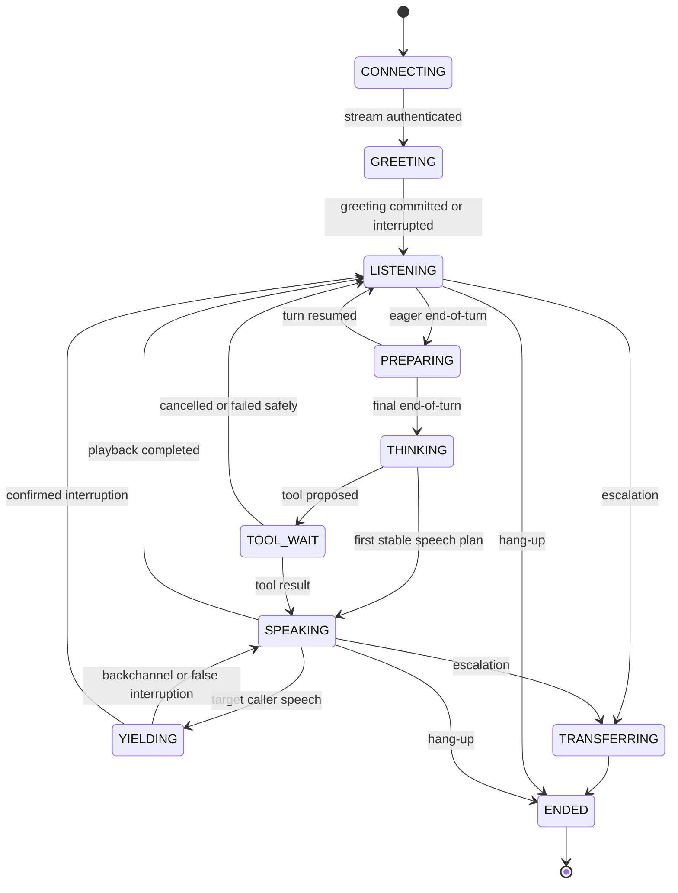

# VoiceOps Technical Moat Deep Research and Implementation Blueprint

## Executive summary

The repository has progressed beyond a basic demo: it contains multiple speech-to-text and text-to-speech adapters, Deepgram streaming code, Silero voice activity detection, Twilio Media Streams support, Qwen3-TTS experiments, Cartesia streaming, filler audio, barge-in classification, observability, booking tools and a sizeable test suite. However, these capabilities are not composed into a coherent real-time voice system.

The production Twilio path still describes itself as a turn-based MVP and performs:

```text
buffer until silence
→ batch transcription
→ complete LLM response
→ complete TTS synthesis
→ telephony playback
```

That behaviour is visible in `apps/api/app/routes/twilio.py:19–26`, `246–309` and `338–349`. The Deepgram streaming implementation, TTS streaming abstractions and experimental voice models largely sit beside this path rather than inside it.

A fresh repository test run produced:

| Result | Count |
|---|---:|
| Passed | 464 |
| Failed | 37 |
| Skipped | 37 |
| Warnings | 123 |

The failures include speech normalisation, multi-tenancy, SQLite vector retrieval, ElevenLabs-compatible routes and Cartesia runtime dependencies. The immediate implication is that the research platform itself is not yet reproducible enough to support trustworthy model experiments.

The proposed commercial roadmap treats tenant voice cloning as roughly a two-week feature. That is adequate for adding a provider voice ID, but not for building a defensible voice system. fileciteturn0file0 The technical moat requires three mutually reinforcing assets:

| Moat component | What it owns | Why it is defensible |
|---|---|---|
| **Temporal conversation kernel** | Listening, endpointing, interruptions, cancellation, playback state, tool timing and concurrency | Provider APIs do not supply a reliable end-to-end conversational controller |
| **Voice Performance Language** | A provider-independent representation of how an utterance should be performed | Prevents the product’s behaviour being reduced to vendor-specific punctuation and sliders |
| **Voice DNA system** | Voice identity, speaking habits, reference selection, pronunciation, telephone behaviour and adaptation history | Produces per-voice data, rankings, corrections and evaluation results that competitors cannot copy by selecting the same TTS model |

The $6 ElevenLabs Starter plan is useful for the first benchmark because it currently includes Instant Voice Cloning. Professional Voice Cloning is a higher-tier capability, and ElevenLabs recommends substantially more source audio for professional cloning than for instant cloning. citeturn1search10turn1search2turn1search4 It should therefore be used as one component in the benchmark, not as the moat itself.

The most important engineering decision is to stop treating audio, transcription, dialogue, tools and speech synthesis as independent request-response adapters. One authoritative actor must own each live call. Every partial transcript, LLM token, tool result, audio chunk, Twilio playback acknowledgement and interruption must carry a generation identifier and be accepted or discarded by that actor.

A credible twelve-week result is possible with a **balanced team of approximately four engineers plus half-time speech research and quality engineering**, totalling about **54 person-weeks**. A two-engineer team can implement the temporal kernel and one voice pipeline in twelve weeks, but not the complete experiment matrix, GPU platform, Voice DNA system and provider comparison.

The first release gates should be:

1. All existing tests green under a locked environment.
2. One serialised actor per live call.
3. Signed, one-use Twilio stream tokens.
4. Streaming STT, LLM and TTS connected end to end.
5. Native telephony audio or one controlled PCM-to-μ-law conversion.
6. Twilio playback marks and an explicit speech commit horizon.
7. Immutable voice-profile versions and approved reference assets.
8. A typed VPL schema with deterministic provider compilers.
9. A reproducible telephony degradation and listening-test harness.
10. Measured evidence that Voice DNA retrieval or adaptation beats a plain provider clone.

## Repository diagnosis and missing subsystem map

The repository’s primary weakness is not lack of code. It is the absence of contracts that preserve temporal, acoustic and identity information across the system.

`STTEvent` currently carries only `kind`, `text` and `is_final` in `apps/api/app/providers/base.py:44–58`. It cannot represent hypothesis revisions, word timings, confidence, endpoint probability, speaker identity or caller acoustic state. `LLMProvider.stream()` defaults to waiting for a complete response and yielding it once at `base.py:33–41`. `TTSProvider.stream_sentences()` receives a complete text string and yields `(bytes, mime)` without alignment, cancellation, generation IDs or playback metadata at `base.py:103–121`.

The active Twilio route has additional temporal defects:

- It uses a fixed 700 ms silence rule and a twelve-second utterance cap at `routes/twilio.py:53–59`.
- Every completed utterance starts an independent `asyncio.create_task()` at `routes/twilio.py:273–278`.
- A filler task races the dialogue turn at `routes/twilio.py:298–304`.
- TTS is synthesised in one complete request at `routes/twilio.py:338–349`.
- Barge-in is checked by repeatedly batch-transcribing buffered audio rather than maintaining a continuous target-speaker stream.
- The route sends Twilio `clear` but does not use Twilio `mark` events to establish which words the caller actually heard.
- The WebSocket is accepted without a one-time stream token.
- The session manager is built around process-global dictionaries and cached provider/business objects in `app/core/session_manager.py:23–28` and `53–84`.

Twilio’s bidirectional Media Streams protocol expects raw base64-encoded μ-law audio at 8 kHz. It buffers outbound media; `clear` removes queued audio, while `mark` events allow the application to determine whether a named point in the playback stream completed or was cleared. citeturn0search0 Twilio does not support arbitrary query parameters on `<Stream>` URLs; custom `<Parameter>` values should be included in the TwiML and read from `start.customParameters`. citeturn0search1turn0search8 The existing `_twiml_stream_response()` at `routes/twilio.py:78–85` does not use that mechanism.

The ElevenLabs adapter performs a complete HTTP request and returns `audio/mpeg` in `providers/tts/elevenlabs_tts.py:20–37`, while `_tts_bytes_to_mulaw()` deliberately rejects MP3 at `routes/twilio.py:148–203`. ElevenLabs can stream audio and return telephony-oriented μ-law output, including `ulaw_8000`, so the current mismatch is avoidable. Its WebSocket API also provides alignment data that can support a playback ledger. citeturn1search1turn0search5

Cartesia is closer to the desired architecture but uses a per-utterance SSE path in `providers/tts/cartesia_tts.py`. The official WebSocket API supports persistent contexts, multiplexing, cancellation and timestamps, which are directly useful for one context per conversational turn. citeturn2search0turn2search7turn2search9 The repository defaults to Sonic 3, while Cartesia’s June 2026 migration guidance recommends current Sonic 3.5 models and states that older models and endpoints were discontinued. citeturn2search2

Qwen3-TTS is loaded and invoked synchronously inside the API process in `providers/tts/qwen3_tts.py:83–121` and `129–193`. Its public interface accepts paths or URLs as per-call voice references, has no controlled voice-profile registry and has no worker boundary. The Qwen3-TTS paper describes multilingual, controllable and streaming-oriented models with short-reference cloning, but the actual serving path available to this repository must be benchmarked independently rather than inheriting paper-level latency assumptions. citeturn3academia47

The target architecture should be:

```mermaid
flowchart LR
    TW[Twilio or SIP] --> MG[Authenticated media gateway]
    MG --> CA[Per-call temporal actor]

    CA <--> STT[Streaming STT worker]
    CA <--> LLM[Streaming dialogue and tool planner]
    CA --> VP[VPL planner and compiler]
    VP --> VR[Voice router]

    VR --> EL[ElevenLabs WebSocket]
    VR --> CT[Cartesia WebSocket]
    VR --> QW[Qwen GPU worker]

    EL --> PL[Playback ledger]
    CT --> PL
    QW --> PL
    PL --> MG

    CA <--> TOOL[Transactional tool executor]
    TOOL <--> IO[Inbox and outbox]

    VPR[Voice profile registry] --> VP
    RB[Reference bank] --> VP
    PD[Pronunciation service] --> VP

    EV[Event and evaluation store] <-- CA
    EV <-- PL
    EV <-- STT
    EV <-- VR
    EH[Evaluation harness] <--> EV
```

The following subsystem and API map is the recommended implementation contract. Public endpoints should use external authentication and tenant scoping; `/internal` interfaces should be service-authenticated and unavailable from the public network.

| Priority | Missing subsystem | Concrete endpoint or interface | Required behaviour |
|---|---|---|---|
| P0 | Per-call actor registry | `CallActorRegistry.start(call_context)`, `.route(call_id, event)`, `.stop(call_id)` | Exactly one active owner of mutable state for each call |
| P0 | Twilio stream token issuer | `POST /v1/calls/{call_id}:issue-stream-token` | Returns a one-use, ≤60-second token bound to tenant, Call SID and nonce |
| P0 | Authenticated Twilio media stream | `WS /twilio/stream` | Validates `start.customParameters.token`, Call SID, Account SID, expiry and nonce consumption |
| P0 | Rich streaming STT | `STTSession.open(context)`, `.send(AudioFrame)`, `.events()` | Partial revisions, final turns, endpoint probabilities, word timing, speaker probability and acoustic state |
| P0 | Streaming LLM planner | `LLMSession.generate(TurnPlanRequest) -> AsyncIterator[LLMDelta]` | Text deltas, tool-call deltas, cancellation, stable-prefix notifications and usage |
| P0 | Streaming TTS runtime | `TTSSession.synthesise(stream SynthesisInput) -> stream AudioEvent` | Audio frames, alignment, flush acknowledgements, cancellation and provider metrics |
| P0 | Native telephony output | `AudioFormat(codec="mulaw", rate=8000, channels=1)` | ElevenLabs produces μ-law directly; local/Cartesia PCM is converted once at the gateway |
| P0 | Playback ledger | `PlaybackLedger.queue()`, `.mark_sent()`, `.mark_received()`, `.clear()` | Tracks generated, sent, buffered, heard and discarded text/audio |
| P0 | VPL schema and compiler | `POST /v1/vpl:validate`, `POST /v1/vpl:compile?provider=...` | Strong validation, capability downgrades, deterministic provider payloads and warnings |
| P0 | Voice profile registry | `POST /v1/voice-profiles`, `GET /v1/voice-profiles/{id}` | No external provider voice IDs accepted by ordinary call APIs |
| P0 | Voice versioning | `POST /v1/voice-profiles/{id}/versions`, `POST .../{version}:activate` | Immutable versions, model and reference hashes, quality status and rollback |
| P0 | Consent lifecycle | `POST /v1/voice-profiles/{id}/consent-artifacts`, `POST ...:revoke` | Approved use, subject identity, scope, expiry and immediate revocation cascade |
| P0 | Transactional tool inbox/outbox | `InboxRepository.claim(event)`, `OutboxRepository.enqueue(tx, action)` | Unique request hash, atomic side-effect reservation, leases, retries and dead-letter status |
| P1 | Pronunciation dictionary | `PUT /v1/voice-profiles/{id}/pronunciations/{term}` | Locale, IPA or provider alias, approval, version and provider compilation |
| P1 | Pronunciation testing | `POST /v1/voice-profiles/{id}/pronunciations:test` | Synthesises and re-transcribes telephone audio; reports term accuracy |
| P1 | Reference ingestion | `POST /v1/voice-profiles/{id}/references:ingest` | Upload, quality analysis, segmentation, alignment, embeddings and review queue |
| P1 | Reference retrieval | `POST /v1/voice-profiles/{id}/references:search` | Hard tenant/version filters followed by style, phonetic and quality ranking |
| P1 | Offline voice rendering | `POST /v1/voice-profiles/{id}:render` | Reproducible output from a pinned profile version, VPL and provider version |
| P1 | Evaluation runs | `POST /v1/evaluations/runs`, `POST .../{id}:execute` | Immutable experiment specification, condition randomisation and artefact tracking |
| P1 | Listening tests | `POST /v1/listening-tests`, `POST .../{id}/ratings` | Blind A/B, ABX and MOS collection with rater-quality controls |
| P1 | Codec simulation | `POST /v1/codec-simulations` | μ-law, packetisation, loss, jitter, noise, echo and clipping conditions |
| P1 | Timeline and replay | `GET /v1/calls/{call_id}/timeline`, `POST ...:replay` | Deterministic event sequence, latency spans and audio reconstruction |
| P2 | Acoustic adaptation service | `AcousticStateEstimator.process(AudioFrame)` | Target speaker, arousal, uncertainty, overlap, hesitation and urgency estimates |
| P2 | Preference ranker | `ReferenceRanker.score(context, candidates)` | Learns from listening-test and production correction data |
| P2 | Hybrid duplex layer | `DuplexSession.listen_and_respond()` | Social timing and backchannels around the deterministic tool agent |

The technical security model must protect voice uniqueness itself, not merely API access:

| Primitive | Required rule |
|---|---|
| Voice asset addressing | All runtime calls use an internal `voice_profile_version_id`; provider voice IDs and file URLs are resolved server-side |
| Object isolation | Reference audio, embeddings, outputs and derived features are partitioned by tenant and profile version |
| Encryption | Original recordings use tenant-scoped envelope keys; derived artefacts inherit the same access boundary |
| Vector isolation | Tenant and profile predicates are mandatory before nearest-neighbour search, not post-filtered |
| Consent binding | Every source segment points to an active consent artefact and permitted-use scope |
| Clone job authorisation | Clone creation operates only on approved, immutable reference manifests |
| Generation audit | Every output records profile version, VPL hash, provider/model version, references, pronunciation version and output hash |
| Revocation | Revoking consent immediately disables generation, closes active voice sessions and schedules provider-side deletion where supported |
| Provider credentials | Stored in a secret manager; central credentials are not exposed to tenant clients |
| Signed media access | Short-lived signed URLs only; no persistent public audio URLs |
| Cross-tenant tests | Every registry, retrieval and rendering path must have negative isolation tests |

## Temporal conversation kernel

The temporal kernel should be designed as an actor system, not as a collection of route-level coroutines. One actor owns one call. Only that actor may mutate call state. STT, LLM, tools and TTS may run concurrently, but they communicate through immutable events placed in the actor’s bounded mailbox.

A suitable state machine is:



`PREPARING` is important. Deepgram Flux distinguishes an early indication that a turn may have ended from a final end-of-turn event, and emits a resumed-turn signal when the user continues. This enables speculative LLM work without prematurely committing speech or irreversible tools. citeturn0search2 Ordinary silence-based endpointing is less semantically informed and should remain a fallback rather than the primary controller. citeturn0search6

The actor’s canonical event envelope should be immutable:

```python
from dataclasses import dataclass
from enum import Enum
from typing import Any

class EventSource(str, Enum):
    MEDIA = "media"
    STT = "stt"
    LLM = "llm"
    TOOL = "tool"
    TTS = "tts"
    PLAYBACK = "playback"
    TIMER = "timer"
    CONTROL = "control"

@dataclass(frozen=True, slots=True)
class CallEvent:
    call_id: str
    tenant_id: str
    sequence: int
    monotonic_ns: int
    source: EventSource

    # A newer turn generation invalidates events from older turns.
    turn_generation: int

    # A newer speech generation invalidates queued audio and alignment.
    speech_generation: int

    kind: str
    payload: Any
```

The rich STT contract should be closer to:

```python
@dataclass(frozen=True, slots=True)
class SpeechHypothesis:
    utterance_id: str
    revision: int
    text: str
    words: tuple["WordTiming", ...]
    confidence: float | None
    stability: float | None
    endpoint_probability: float | None
    target_speaker_probability: float | None
    acoustic_state: "AcousticState"
    is_final: bool
```

`target_speaker_probability` is different from ordinary speech activity detection. Personal or target-speaker VAD estimates whether detected speech belongs to the intended person, reducing reactions to background speech or other speakers. Research systems explicitly model target speech, non-target speech and non-speech separately. citeturn3academia48turn3academia49

**Concurrency model.** Each call actor should run as one `asyncio` task with a bounded mailbox, for example `asyncio.Queue(maxsize=256)`. It creates child tasks through `asyncio.TaskGroup`, but child tasks never mutate `CallRuntimeState`. They emit `CallEvent` objects back to the actor.

The queue policy should distinguish event classes:

| Event class | Backpressure policy |
|---|---|
| Inbound audio frames | Bounded queue; detect overload before packet loss becomes unbounded |
| Partial STT hypotheses | Coalesce older revisions for the same utterance |
| Final STT and turn events | Never drop |
| LLM text deltas | Coalesce before VPL phrase planning where safe |
| Tool proposals/results | Never drop; persist state transitions |
| TTS audio | Bounded by a small playback window |
| Playback marks | Never drop |
| Metrics | Sample or aggregate under pressure |
| Debug events | May be dropped after an explicit counter increment |

`asyncio.create_task()` at `routes/twilio.py:278` should therefore disappear. Media frames should be events delivered to a call actor. The actor decides whether a completed turn can start, whether an existing generation must be cancelled and whether a tool proposal remains valid.

**Cancellation hierarchy.** A single Boolean `interrupt_flag` is inadequate. The kernel should use nested cancellation scopes:

```text
call lifetime
└── turn generation
    ├── STT hypothesis generation
    ├── LLM generation
    ├── tool proposal
    └── speech generation
        ├── provider synthesis context
        ├── transcoding
        └── outbound playback
```

Each asynchronous operation receives a cancellation token containing the call ID, turn generation, speech generation and deadline. The actor rejects late results even when the provider cannot cancel immediately. Cancellation must therefore be both **active**—send a provider cancellation or close the stream—and **logical**—discard all data whose generation is no longer current.

An irreversible tool must not execute from an eager or partial transcript. The correct sequence is:

```text
eager end-of-turn
→ speculative LLM generation permitted
→ user resumes
→ speculative generation cancelled

or

final end-of-turn
→ final transcript accepted
→ tool proposal validated
→ confirmation policy checked
→ idempotent tool command reserved
→ side effect executed
```

**Commit horizon and playback ledger.** The system needs three separate notions of speech:

1. **Generated:** audio exists inside a TTS provider or worker.
2. **Queued:** audio has been sent to Twilio but may still be buffered.
3. **Heard:** Twilio has acknowledged a playback mark beyond that audio.

The current code treats sent audio as effectively spoken. That corrupts conversation history after an interruption because the LLM may believe the user heard text that was actually cleared.

Each `AudioChunk` should contain:

```python
@dataclass(frozen=True, slots=True)
class AudioChunk:
    generation_id: str
    sequence: int
    audio: bytes
    format: "AudioFormat"
    start_ms: int
    duration_ms: int
    text_start: int | None
    text_end: int | None
    words: tuple["WordAlignment", ...]
    is_final: bool
```

The gateway should send a named Twilio `mark` after phrase boundaries or approximately every 100–250 ms of buffered speech. When a mark returns, the ledger advances the heard-text boundary. On a confirmed interruption, the actor sends `clear`; subsequently returned marks identify material that was cleared rather than completed. This uses the protocol as intended instead of estimating playback from local sleeps. citeturn0search0

A practical initial commit-horizon target is **200–400 ms of uninterruptible audio**. This is an engineering target, not a provider guarantee. The exact value should be selected by Experiment Seven because smaller horizons improve responsiveness but increase network and mark overhead.

**Barge-in should use two stages.**

| Stage | Trigger | Immediate action | Final action |
|---|---|---|---|
| Acoustic suspicion | Target-speaker speech probability rises while the agent speaks | Duck or freeze new audio; preserve current provider context temporarily | Wait for semantic confirmation |
| Semantic confirmation | Stable caller words or sustained target speech | Send `clear`, cancel speech generation and advance turn generation | Commit interruption text to the next turn |
| Backchannel classification | Short acknowledgements such as “right” or “mm-hm” | Keep the response context available | Resume playback or continue synthesis |
| False trigger | Noise, other speaker or television | Unduck quickly | Do not alter dialogue history |

The current lexical classifier in `packages/voice/barge_in.py` can remain one feature, but it should not be the sole decision-maker.

**Latency budget.** The following should be adopted as internal engineering targets, measured at p50 and p95 for every call:

| Stage | Balanced target |
|---|---:|
| Inbound frame to STT service | p95 < 60 ms |
| First stable partial after speech | p95 < 300 ms |
| Final endpoint after true user completion | p50 250–450 ms |
| Final endpoint to first speakable LLM phrase | p95 < 400 ms |
| TTS request to first audio | p95 < 350 ms cloud, < 500 ms local |
| Gateway buffer before playback | 100–250 ms |
| End-of-turn to first audible response | p50 < 700 ms; p95 < 1,000 ms |
| Confirmed barge-in to audible stop | p95 < 250 ms |
| Cancellation propagation to local worker | p95 < 150 ms |

Pre-emptive generation can reduce latency, but the conversation history must be truncated to what was actually heard after interruption. LiveKit’s agent framework implements both pre-emptive synthesis and heard-audio truncation, making it a useful reference implementation or benchmark even if VoiceOps retains its own runtime. citeturn7search1turn7search9

**RPC and worker layout.** The real-time actor should stay close to the media gateway. It should not be implemented as a durable workflow engine hop for every frame. Durable workflow systems are suitable for post-call tasks, clone training and experiment orchestration, but media timing should remain in a low-latency process.

The suggested internal service layout is:

```text
Media gateway process
├── Twilio protocol parser
├── token verifier
├── call actor registry
├── playback ledger
└── codec boundary

STT service
├── persistent Deepgram Flux session
├── partial/final event normaliser
└── acoustic feature side-channel

Dialogue service
├── streaming LLM adapter
├── policy and tool planner
├── semantic response planner
└── VPL planner

TTS router
├── provider capability registry
├── ElevenLabs session pool
├── Cartesia context pool
├── Qwen gRPC client
└── fallback controller

GPU worker
├── warm Qwen model
├── voice-conditioning cache
├── bounded synthesis scheduler
└── bidirectional gRPC stream

Durable services
├── voice registry
├── reference and pronunciation store
├── inbox/outbox
├── evaluation artefacts
└── analytics/event store
```

The TTS worker RPC should be bidirectional:

```protobuf
service SpeechSynthesis {
  rpc Synthesize(stream SynthesisInput)
      returns (stream SynthesisEvent);
}

message SynthesisInput {
  oneof body {
    BeginSynthesis begin = 1;
    TextDelta text_delta = 2;
    Flush flush = 3;
    Cancel cancel = 4;
  }
}

message BeginSynthesis {
  string call_id = 1;
  string generation_id = 2;
  string voice_profile_version_id = 3;
  bytes compiled_vpl = 4;
  int64 deadline_unix_ms = 5;
}

message SynthesisEvent {
  oneof body {
    AudioChunk audio = 1;
    Alignment alignment = 2;
    FlushComplete flush_complete = 3;
    SynthesisMetrics metrics = 4;
    SynthesisError error = 5;
  }
}
```

The same control shape should be used for cloud providers even when their underlying APIs differ. That keeps actor logic independent of vendor-specific protocols.

## Voice DNA and Voice Performance Language

A voice clone normally captures some degree of timbre and identity. Voice DNA must represent a broader interactive phenotype:

```text
Voice DNA
├── identity and timbre
├── language, accent and dialect
├── pronunciation rules
├── habitual speaking rate
├── rhythm and pause distributions
├── pitch and energy range
├── emotional operating range
├── phrase-final contours
├── greetings and backchannels
├── repair and clarification style
├── number, date and name behaviour
└── degradation characteristics over telephone audio
```

This distinction matters because the optimal reference for identity is not always the optimal reference for warmth, reassurance, urgency or pronunciation. ElevenLabs recommends clean, consistent material for instant cloning and indicates that roughly one to two minutes is normally sufficient for that mode; Professional Voice Cloning requires much more material. citeturn1search4turn1search2 Cartesia similarly distinguishes quick cloning from a longer professional-clone workflow, and its own guidance emphasises that source pacing and style influence the resulting voice. citeturn2search5turn2search1

A production data model should include:

| Entity | Essential fields |
|---|---|
| `voice_profile` | `id`, `tenant_id`, owner identity, default locale, intended uses, status, creation and revocation times |
| `voice_profile_version` | Immutable manifest hash, source dataset hash, compiler version, active pronunciation version, quality status, activation time |
| `voice_consent_artifact` | Subject identity, consent method, signed content hash, scope, jurisdictions, expiry, revocation and verifier |
| `voice_reference_asset` | Encrypted object key, content hash, transcript, language, duration, source device, consent ID and ingest status |
| `voice_reference_segment` | Start/end, aligned text, phones, style tags, speech act, acoustic statistics, quality scores and embeddings |
| `voice_provider_binding` | Provider, external voice ID, model/base version, region, creation job, status and deletion receipt |
| `pronunciation_version` | Locale, immutable entry manifest, compiled provider dictionaries and activation time |
| `pronunciation_entry` | Term, aliases, IPA or phoneme sequence, context, approval and test results |
| `voice_generation_audit` | Call/turn, VPL hash, profile version, provider/model, references used, audio hash and measured latency |
| `voice_quality_result` | Experiment, condition, codec path, identity score, intelligibility, naturalness, appropriateness and human ratings |

The API should never accept a raw Qwen reference URL or provider voice ID during an ordinary call. `providers/tts/qwen3_tts.py:132–158` currently permits a URL or path to become a voice reference. That should be replaced by a registry lookup whose result is an approved, immutable and tenant-owned reference manifest.

**Reference ingestion pipeline.**

```text
Upload
→ content and malware validation
→ content hash and encrypted original storage
→ channel normalisation
→ speaker diarisation and target-speaker verification
→ voice activity segmentation
→ transcription
→ word and phoneme alignment
→ acoustic quality scoring
→ speaker/style/prosody embeddings
→ automatic speech-act and style labels
→ human review
→ immutable reference-bank version
```

Recommended segmentation parameters for the initial system are 2–12 second clips with complete phrases where possible. Segments should be rejected or penalised for clipping, overlapping speakers, severe reverberation, music, low signal-to-noise ratio, mismatched transcript or excessive silence.

For speaker representation, an established speaker-verification encoder such as ECAPA-TDNN is a reasonable baseline; it produces fixed-dimensional speaker embeddings from variable-length speech. citeturn8academia49 This metric should not be treated as complete perceptual identity. Cross-language conditions can alter speaker-verification behaviour, so multilingual profiles must be evaluated per language rather than assuming one universal threshold. citeturn8academia51

For alignment, use a fast CTC or Whisper-derived path during ingestion and a more precise forced aligner for approved reference assets and pronunciation evaluation. Comparative research has found that traditional forced-alignment systems can outperform newer ASR-derived alternatives on manually aligned datasets, which supports retaining a high-accuracy offline alignment stage. citeturn8search13

**Reference-bank retrieval.** Retrieval should start with hard filters:

```text
tenant_id
voice_profile_id
active profile version
active consent
locale or permitted cross-language mapping
approved quality state
allowed use case
```

Only then should vector or feature ranking occur. A useful first scoring function is:

\[
\begin{aligned}
score(r, q) =\;&
0.25\,style\_similarity +
0.20\,speech\_act\_match +
0.15\,phoneme\_coverage \\
&+ 0.15\,rate\_match +
0.10\,energy\_match +
0.10\,quality +
0.05\,length\_fitness \\
&- overlap\_penalty
- noise\_penalty
- repetition\_penalty
\end{aligned}
\]

The exact weights must be learned or tuned through Experiment Two. Speaker similarity is mainly a quality gate because all candidates should already belong to the same approved voice. Retrieval should use maximal marginal relevance or an equivalent diversity term when selecting multiple references, avoiding three near-identical neutral clips.

This approach is directly useful for Qwen and other reference-conditioned systems. For ElevenLabs and Cartesia, where a provider voice ID encapsulates the clone, the bank still supports:

- choosing training and re-cloning material;
- producing style-specific provider voice versions;
- selecting source performances for speech-to-speech conversion;
- calibrating VPL delivery;
- telephone survival analysis;
- pronunciation and identity regression testing.

**Voice Performance Language.** VPL should separate semantic content from performance. A proposed schema is:

```json
{
  "version": "1.0",
  "utterance_id": "utt_01J...",
  "locale": "en-GB",
  "text": "I understand. Let me check Tuesday afternoon.",
  "speech_act": "acknowledge_then_tool_transition",

  "delivery": {
    "style": "reassuring",
    "intensity": 0.34,
    "rate": 0.92,
    "energy": 0.38,
    "pitch_semitones": -0.5,
    "pitch_range": "narrow",
    "stability": 0.64,
    "identity_strength": 0.86,
    "phrase_finality": "continuing",
    "interruptibility": "high",
    "pause_before_ms": 0,
    "pause_after_ms": 150,
    "breaths": "none"
  },

  "emphasis": [
    {
      "start": 27,
      "end": 44,
      "strength": 0.35
    }
  ],

  "pauses": [
    {
      "after_character": 13,
      "duration_ms": 120
    }
  ],

  "pronunciation_refs": [
    "pron_version_7"
  ],

  "context": {
    "conversation_id": "call_...",
    "turn_id": "turn_...",
    "prior_spoken_text": "Of course.",
    "next_intent": "calendar_lookup"
  },

  "safety": {
    "allow_nonverbal_vocalisation": false,
    "maximum_emotional_intensity": 0.5
  }
}
```

The schema should be validated with strict ranges and enums. It should not expose arbitrary vendor markup. Non-verbal elements such as laughter, sighing or whispering must be explicit allowlisted fields subject to business-context policy.

The VPL planner should itself have two stages:

```text
Semantic response planner
→ what factual content should be spoken

Performance planner
→ how that content should be delivered
```

The dialogue LLM may propose both, but deterministic validation should enforce:

- maximum utterance length;
- prohibited emotional behaviour by domain;
- no laughter or casual vocalisations during emergencies, payments or sensitive health discussions;
- no exaggerated mirroring of anger or distress;
- pronunciation entry validation;
- bounded rate, pitch, energy and pause values;
- provider capability downgrade rules.

The compiler contract should return both a payload and an explicit degradation report:

```python
@dataclass(frozen=True)
class CompiledSpeechPlan:
    provider: str
    model: str
    request_payload: dict
    output_format: AudioFormat
    references: tuple[str, ...]
    unsupported_fields: tuple[str, ...]
    approximations: tuple[str, ...]
    compiler_version: str
```

Provider mapping should be capability-driven:

| VPL feature | ElevenLabs compiler | Cartesia compiler | Qwen compiler |
|---|---|---|---|
| Voice identity | Resolve approved ElevenLabs voice binding | Resolve approved Cartesia voice binding | Resolve approved reference or conditioning cache |
| Output codec | Request `ulaw_8000` on telephony path | Request raw 8 kHz or 16 kHz PCM; convert once at gateway | Return PCM chunks; convert once at gateway |
| Streaming | Text-to-speech WebSocket | Persistent WebSocket context | Bidirectional gRPC to warm local worker |
| Rate | Supported provider speed setting where model allows | Provider speed/control if supported by pinned model | Style instruction or model control |
| Stability | Map to ElevenLabs voice settings | Translate only if model exposes equivalent | Conditioning or decoding configuration |
| Identity strength | Similarity/voice settings within tested bounds | Provider voice controls where available | Reference selection and conditioning weight |
| Style and intensity | Context, selected voice version and conservative model-supported controls | Context and model-supported emotion controls | Natural-language instruction plus retrieved references |
| Emphasis and pauses | Phrase chunking, punctuation and context; avoid arbitrary tags in Flash | Context-preserving text chunks and timestamps | Explicit instruction, text segmentation and reference selection |
| Pronunciation | ElevenLabs pronunciation dictionary locator | Cartesia pronunciation dictionary or text normalisation | Phoneme/alias preprocessing and reference examples |
| Alignment | Consume WebSocket alignment events | Consume timestamps/flush IDs | Worker-side forced alignment or model timestamps |
| Cancellation | Close/cancel active synthesis generation and reject late chunks | Cancel the context ID | Cancel token checked during generation and chunk emission |
| Prior/next context | Supply supported text context fields | Keep a context per utterance and stream continuations | Include semantic context in the instruction where useful |
| Non-verbal tags | Disabled by default; separate v3 experimental compiler | Only when current model capability explicitly supports it | Controlled instruction and post-generation validation |

ElevenLabs’ streaming API can return alignment and accepts pronunciation dictionary references on supported endpoints. citeturn1search1turn1search5 Cartesia’s WebSocket context and timestamp mechanisms offer cleaner cancellation and attribution than the repository’s current SSE wrapper. citeturn2search0turn2search9

The compiler must not pretend that every provider implements every VPL field. Unsupported controls should be measured and recorded, not silently approximated. This capability matrix is itself valuable: it permits provider selection based on a specific voice, speech act and latency requirement rather than one global provider setting.

A practical voice-routing decision could be:

\[
provider = \arg\max_p
\left(
Q_{identity}
+ Q_{style}
+ Q_{pronunciation}
+ Q_{telephone}
- C_{latency}
- C_{cost}
- C_{failure}
\right)
\]

The scores should be profile-version specific. A provider that wins for one voice or language may lose for another.

## Model serving, provider strategy and telephony quality

The repository needs a split between the API/media runtime and GPU inference. `Qwen3TTS.synthesize()` currently calls synchronous model generation inside an async method. Under concurrent calls, one long generation can block the event loop or monopolise the GPU without meaningful cancellation.

Three infrastructure options are appropriate.

| Option | Architecture | Suitable for | Limitations |
|---|---|---|---|
| Minimal | Two dedicated Python GPU worker processes, one per GPU; custom bidirectional gRPC; Redis only for routing/leases | Two engineers, one local model, early experiments | Manual scheduling and fewer autoscaling features |
| Balanced | Custom streaming Qwen workers, NATS or Redis for ownership/events, Postgres/pgvector, S3-compatible object store, Kubernetes or Compose, Triton for stateless embedding/VAD models | Recommended twelve-week programme | More operational work, but keeps autoregressive streaming under direct control |
| Enterprise | Multi-region media gateways, Kubernetes GPU node pools, dedicated model-serving control plane, Triton/sequence scheduling where compatible, autoscaling by active streams and memory | Larger deployment and multiple local models | Highest platform cost and operational complexity |

The existing roadmap references two RTX 3090 GPUs, which are sufficient for a serious local research bench if the system carefully controls model residency and concurrency. fileciteturn0file0 They should be treated as fixed-capacity resources rather than as a general-purpose model-loading pool.

**Worker requirements.**

| Requirement | Implementation |
|---|---|
| Warm model residency | Load each production model at worker startup and execute a warm-up phrase |
| Conditioning cache | Cache approved voice embeddings or reference preprocessing by immutable profile version |
| Bounded queue | Reject or route elsewhere before latency becomes unbounded |
| First-audio priority | Avoid large batches before first packet; allow micro-batching only within a very small window |
| Stateful pinning | Keep a synthesis context on the same worker for its lifetime |
| Cancellation | Check cancellation between generation steps and before every emitted chunk |
| Deadlines | Reject work that cannot meet the call deadline |
| Memory guard | Reserve 15–20% GPU memory headroom and stop admitting work before out-of-memory conditions |
| Health reporting | Model loaded, free memory, active streams, queue time, generation speed and cancellation delay |
| Graceful drain | Stop accepting new contexts, finish or cancel existing contexts, then unload |
| Reproducibility | Pin model weight hash, runtime, CUDA stack, compiler and decoding configuration |

NVIDIA Triton provides model instance groups, dynamic batching for compatible stateless work and sequence-oriented scheduling for stateful models. citeturn6search0turn6search1 Its model warm-up and sequence correlation mechanisms are also useful. citeturn6search2 For Qwen’s custom autoregressive streaming path, a dedicated worker is likely simpler initially; Triton is more immediately useful for speaker embeddings, acoustic classifiers, VAD, forced-alignment components and batched ingestion.

**Batching strategy.**

- Do not wait tens of milliseconds to create a large batch for first-audio generation.
- Permit a 5–10 ms micro-batch window only after benchmarks show a throughput gain without harming first-audio latency.
- Batch offline reference embeddings, quality analysis and experiment rendering aggressively.
- Pin each live voice context to one worker.
- Prefer queue rejection or cloud fallback over unlimited waiting.
- Pre-render invariant greetings, transfer notices and emergency phrases into μ-law, versioned by voice profile and pronunciation version.

**Provider recommendations.**

| Layer | Minimal choice | Balanced recommendation | Enterprise or R&D extension |
|---|---|---|---|
| Telephony | Twilio Media Streams | Keep Twilio; implement tokens, marks and playback ledger | Add SIP/LiveKit gateway for WebRTC, alternate carriers and benchmark portability |
| STT and endpointing | Existing Deepgram Nova path | Deepgram Flux for English conversational endpointing; Nova-3 fallback | Target-speaker VAD plus additional multilingual/on-prem STT |
| Cloud cloned TTS | ElevenLabs Starter IVC | ElevenLabs Flash/Turbo WebSocket with native μ-law | Professional clone only after measured identity benefit justifies cost |
| Low-latency TTS comparison | Existing Cartesia account | Cartesia Sonic 3.5 WebSocket with contexts and cancellation | Per-voice routing between Cartesia and ElevenLabs |
| Owned TTS | Qwen3-TTS offline experiments | Dedicated Qwen worker with reference bank | Per-voice adapters, fine-tuning or performance-transfer research |
| LLM | Existing provider | Any provider with reliable streaming text and tool-call deltas behind the new contract | Local or regional routing, speculative small-model planner and larger verifier |
| Duplex research | None | LiveKit framework as benchmark, not core dependency | PersonaPlex/Moshi-style social timing layer |
| Embeddings | ECAPA-TDNN baseline | Speaker embedding plus separate style/prosody representation | Learned ranking model trained from VoiceOps preferences |
| Storage | SQLite for local development only | Postgres, pgvector and encrypted object storage | Tenant-pinned regional stores and immutable artefact retention |

Deepgram Flux supplies conversational turn events such as eager end-of-turn and turn-resumed, which match the required kernel better than fixed silence thresholds. citeturn0search2 Deepgram’s newer TTS streaming offering is interesting as an experiment, but its current early-access status and potentially changing API make it unsuitable as the sole production dependency. citeturn0search9

Cartesia’s production path should move from SSE to a persistent WebSocket and pin a current API version and Sonic 3.5 model. Context cancellation and flush identifiers are particularly valuable for interruption-safe generation. citeturn2search0turn2search2turn2search9 Highly expressive output should not automatically be preferred; Cartesia itself notes that stable voices may be more appropriate for many production agents. citeturn2search4

ElevenLabs should be used in two modes:

- **Real-time default:** a tested Instant Voice Clone with a low-latency streaming model and native μ-law output.
- **Offline quality comparison:** higher-expression models or speech-to-speech conversion for fixed phrases, experiments and performance transfer.

The Starter plan is enough to begin Instant Voice Clone testing, but not to establish whether Professional Voice Cloning materially improves the particular voice under telephone conditions. citeturn1search10turn1search2

Qwen3-TTS should become the owned-model research path. Its value is not merely lower marginal cost; it enables reference control, adaptation, model inspection and on-prem deployment. The model report describes streaming and voice cloning capabilities, but the repository must measure first-packet latency, real-time factor, memory, interruption behaviour and concurrency using the exact public implementation and hardware. citeturn3academia47

PersonaPlex and Moshi should be treated as research comparators for full-duplex behaviour, not immediate replacements for deterministic booking tools. Moshi models parallel audio streams for user and system, while PersonaPlex combines an audio voice prompt with a text role prompt and supports simultaneous listening and speaking. citeturn3academia50turn5search0 Full-duplex benchmarks already include interruptions, backchannels, ambient speech and side conversations, which should be adopted as scenario templates. citeturn5academia27

**Telephone survival simulator.** Every voice experiment must render both clean and telephone-channel conditions:

```text
24 kHz or 48 kHz generated audio
→ band-limit to telephone range
→ resample to 8 kHz
→ G.711 μ-law encode/decode
→ packetise into 20 ms frames
→ apply jitter, reordering and packet loss
→ optional packet-loss concealment
→ add background noise, echo and clipping
→ play or re-transcribe
```

The standard condition grid should include:

| Dimension | Conditions |
|---|---|
| Codec | Clean PCM; 8 kHz μ-law |
| Packet loss | 0%, 1%, 3%, 5%; include burst-loss cases |
| Jitter | 0, 20, 50 and 100 ms |
| Noise | Clean, 20 dB, 10 dB and 5 dB SNR |
| Device | Handset-like, speakerphone-like and laptop microphone responses |
| Echo | None, mild room echo and strong speakerphone echo |
| Level | Nominal, quiet, clipped |
| Language | English first; later every supported profile language |
| Utterance | Names, numbers, dates, addresses, emotional lines, short acknowledgements and long explanations |

The final validation must include real Twilio calls because a laboratory codec simulation does not reproduce every carrier, handset, network and acoustic interaction. Twilio’s required outbound format should remain the canonical telephone test format. citeturn0search0

**Automated evaluation.**

| Dimension | Metrics |
|---|---|
| Intelligibility | ASR word error rate, character error rate, named-entity word accuracy |
| Identity | Speaker-embedding similarity, same/different verification error, clean-to-telephone retention |
| Prosody | F0 contour correlation, rate, pause-duration error, energy contour and phrase-finality classification |
| Noise/artefacts | DNSMOS SIG, BAK and OVRL; clipping, discontinuity and silence detectors |
| Timing | First partial, endpoint delay, first LLM delta, first audio, playback commit and barge-in stop |
| Stability | Identity drift across turns, repeated phrases, languages and emotional conditions |
| Tool performance | Task completion, confirmation accuracy, duplicate-side-effect rate and recovery |
| Interaction | Overlap rate, false interruptions, missed interruptions, backchannel handling and repair success |

DNSMOS P.835 produces estimates for speech quality, background quality and overall quality, but subjective listening remains the decision standard. citeturn4academia1 Recent comparisons show that objective codec-quality metrics differ materially by condition and can saturate at high quality. citeturn4academia2 Learned MOS estimators can also be manipulated or behave unexpectedly, so no single automated score should determine voice quality. citeturn4academia0

**Blind listening interface.** The evaluation UI should:

- randomise provider and condition labels;
- level-match audio before comparison;
- support A/B preference, ABX identity and five-point ratings;
- collect naturalness, identity, expression appropriateness, pronunciation and artefact scores separately;
- include attention-check pairs;
- prevent a rater from repeatedly receiving the same source in a predictable order;
- record headphones/device and language familiarity;
- stratify results by voice, provider, codec and speech act;
- report bootstrap confidence intervals and a mixed-effects or Bradley–Terry ranking rather than only mean MOS.

Large audio-language models can assist with annotation, but current research suggests calibrating such judges against humans instead of treating them as an independent ground truth. citeturn5academia28

## Experimental programme and acceptance gates

The experiment programme should use a common evaluation corpus so results are comparable across models and weeks.

The recommended **discovery set** is:

- three consented voices;
- at least two accents or dialects;
- sixty prompts per voice;
- ten speech-act categories;
- clean and μ-law conditions;
- five independent human judgements per pair.

The **confirmation set** should expand to:

- six voices;
- 120 prompts per voice;
- at least ten judgements per final comparison;
- clean, standard telephone and adverse telephone conditions;
- repeated evaluation across short and long call contexts.

The corpus should include greeting, information delivery, reassurance, apology, clarification, spelling, names, addresses, dates, prices, tool waiting, successful booking, refusal and sensitive or urgent speech. Half the named entities should be deliberately difficult or locally relevant.

The thresholds below are proposed product go/no-go targets, not universal research standards.

| Experiment | Conditions and dataset | Primary metrics | Acceptance threshold | Required tooling |
|---|---|---|---|---|
| **Reference length and style matrix** | For each voice: 3 s, 10 s, 30 s, 60 s and 120 s references; neutral-only, mixed-style and matched-style sets; 60 prompts per voice | Human identity, naturalness, speaker similarity, style accuracy and named-entity WER | Selected condition receives ≥60% pairwise preference over current baseline; no >0.02 absolute loss in normalised identity similarity; telephone named-entity accuracy not worse | Reference ingestion, controlled clone jobs, renderer, listening UI |
| **Static versus dynamically retrieved references** | One static neutral reference versus top-one and top-three retrieved references across ten speech acts | Style appropriateness, identity, prosody distance and preference | Retrieval receives ≥60% preference and reduces style-feature error by ≥10%, without identity non-inferiority breach | Reference bank, style embeddings, ranker, VPL labels |
| **Zero-shot clone versus adaptation** | Provider IVC, Qwen zero-shot, multi-reference conditioning, LoRA/adapter and full fine-tune where feasible | Identity, naturalness, pronunciation, training cost, first audio and real-time factor | Adapted system improves preference by ≥10 percentage points or MOS by ≥0.2 while adding <150 ms p95 first-audio delay | GPU workers, training manifests, immutable model registry |
| **VPL ablation** | Plain text; text plus punctuation; core VPL; full VPL; remove one field family at a time | Preference, speech-act recognition, appropriateness, compiler degradation and latency | Core VPL improves preference by ≥10 percentage points; unsupported-field rate <5% for the chosen production profile | VPL validator, provider compilers, capability logs |
| **Telephone survival** | Clean, μ-law, loss, jitter, noise, echo and level conditions for every provider and voice | Identity retention, WER, named-entity accuracy, MOS and artefacts | Identity similarity retains ≥85% of clean-condition margin; WER increases <3 absolute points in normal telephone and <8 in adverse; identity human rating ≥4/5 | Codec simulator, real Twilio recording loop, objective metrics |
| **End-of-turn comparison** | Fixed 700 ms silence, Silero plus endpointing, Deepgram Flux and learned hybrid; hesitations and resumed turns | Premature cut-off, late endpoint, end-to-first-audio and task success | Premature cut-off <2%; late endpoint beyond 1.2 s <5%; p95 end-to-first-audio <1 s | Deterministic audio replay, turn-labelled corpus, virtual clock |
| **Barge-in architecture** | Lexical-only, VAD plus lexical, target-speaker two-stage and duplex model; interruptions, backchannels and ambient speech | Audible stop latency, false stop, missed interruption and resume time | p95 stop <250 ms; false stop on backchannels <3%; missed intentional interruption <5%; false-trigger resume <700 ms | Playback marks, target-speaker estimator, actor cancellation |
| **Stable-prefix speculative speech** | No speculation, eager LLM only, eager LLM plus TTS, stable-prefix policy; resumed turns and corrections | Latency gain, audible contradiction, cancellation leakage and tool safety | Median response gain ≥150 ms; audible contradiction <0.5%; zero irreversible tools from non-final turns | LLM delta stability tracker, commit ledger, generation IDs |
| **Acoustic-state adaptation** | Text-only policy versus text plus rate, hesitation, arousal and frustration; neutral and stressed callers | Appropriateness, task success, escalation precision and user preference | ≥60% preference for adaptive behaviour; task success no more than one percentage point lower; escalation false-positive rate within agreed domain limit | Acoustic state estimator, VPL planner, labelled recordings |
| **Pronunciation closed loop** | No dictionary, manually curated dictionary, G2P, synth–ASR loop and alignment-guided correction; 300 difficult entities | Entity accuracy, human pronunciation score, ordinary WER regression | ≥98% named-entity word accuracy in standard telephone condition; ordinary WER regression <0.5 points | Pronunciation API, forced alignment, provider compilers |
| **Concurrent GPU serving** | 1, 2, 4, 6, 8 and overload concurrent calls; short and long turns; cancellation storm | First audio, real-time factor, queue time, memory, errors and cancellation delay | On the existing two-GPU bench: sustain target concurrency with p95 local first audio <700 ms, no OOM in 10,000 turns and p95 cancellation <150 ms | Load generator, GPU telemetry, warm worker pool |
| **Hybrid duplex benchmark** | Current pipeline, improved temporal kernel, duplex social layer and end-to-end duplex research model | Task success, naturalness, interruption metrics, tool errors and operator preference | Naturalness +0.3/5 or ≥60% preference; task success non-inferior within three points; no increase in unsafe tool actions | Full-Duplex-Bench-style scenarios, PersonaPlex/Moshi benchmark, tool harness |

The full-duplex scenario library should explicitly include side conversations, callers speaking during the agent’s sentence, backchannels, repeated corrections, disfluencies, ambient speech, self-corrections and multi-step tool tasks. Existing full-duplex benchmarks identify these as distinct failure modes rather than one generic latency score. citeturn5academia26turn5academia27

Voice agents should also be tested end to end rather than assuming text-agent success transfers to audio. Recent benchmark work reports substantial degradation when realistic audio, timing and conversational conditions are introduced. citeturn5academia29

Every experiment run should persist:

```text
experiment specification hash
source dataset version
voice profile version
provider and model version
VPL compiler version
reference IDs
pronunciation version
decoding parameters
software/container hash
GPU and driver
raw output
telephone derivatives
automated metrics
human assignments and ratings
statistical report
decision and rationale
```

An experiment is invalid if any of those inputs cannot be reconstructed.

## Twelve-week implementation plan and code refactoring

The balanced plan assumes four engineers with overlapping specialities—real-time backend, speech/model engineering, data/platform and product/evaluation—plus roughly half-time speech research or quality engineering. The schedule totals approximately 54 person-weeks.

| Sprint | Deliverables | Effort | Principal risk | Mitigation and exit gate |
|---|---|---:|---|---|
| **Week one** | Lock dependencies; make existing tests green; event schema; monotonic timing; deterministic audio replay; baseline latency traces | 4 pw | Existing tests encode conflicting behaviour | Document intended contracts, fix rather than skip; CI must reproduce 0 failures |
| **Week two** | Voice profile, immutable versions, consent artefacts, provider bindings and generation-audit schema; signed object storage | 4 pw | Schema becomes provider-specific | Keep internal profile IDs and version manifests independent of providers |
| **Week three** | Call actor registry, bounded mailbox, generation IDs, TaskGroup lifecycle and sticky call ownership | 5 pw | Race conditions migrate rather than disappear | Only actor mutates state; add property and stress tests |
| **Week four** | Signed Twilio stream tokens, custom TwiML parameters, mark/clear handling, playback ledger and heard-text history | 5 pw | Incorrect mark semantics corrupt history | Protocol replay tests using media, mark and clear traces |
| **Week five** | Deepgram Flux streaming integration, rich STT events, eager/final endpointing and target-speaker side-channel interface | 4 pw | Provider events differ from assumptions | Record raw provider events and preserve them in normalised envelopes |
| **Week six** | Streaming LLM deltas, stable-prefix planner, cancellation and irreversible-tool gating; transactional inbox/outbox | 5 pw | Speculation triggers stale tools or speech | Tools require final generation; request-hash idempotency and crash tests |
| **Week seven** | VPL schema, validator, semantic/performance split, ElevenLabs and Cartesia compilers, pronunciation API | 4 pw | VPL becomes an unbounded prompt format | Strict enums/ranges, capability matrix and compiler snapshots |
| **Week eight** | ElevenLabs native μ-law WebSocket; Cartesia Sonic 3.5 WebSocket contexts; streamed Twilio playback | 5 pw | Provider cancellation and alignment differ | Provider contract tests and fallback to logical cancellation |
| **Week nine** | Qwen dedicated GPU worker, bidirectional gRPC, warm pools, conditioning cache, memory guard and fallback router | 5 pw | Public Qwen implementation lacks required streaming performance | Define a time-boxed benchmark; retain cloud fallback and chunked local mode |
| **Week ten** | Reference ingestion, segmentation, forced alignment, speaker/style embeddings, retrieval API and initial ranker | 4 pw | Automatic labels are noisy | Human approval queue and immutable reference-bank versions |
| **Week eleven** | Codec simulator, real Twilio loop, blind listening UI, automated quality metrics and experiments one through ten screening | 5 pw | Evaluation volume exceeds available raters | Adaptive pair selection; screen broadly, confirm only top conditions |
| **Week twelve** | GPU concurrency, hybrid duplex benchmark, top-condition confirmation, architecture hardening and moat demonstration | 4 pw | Too many systems remain experimental | Freeze one production profile and publish explicit follow-on backlog |

Team-size alternatives are:

| Delivery mode | Team and effort | Realistic twelve-week outcome |
|---|---|---|
| Minimal | Two engineers, approximately 24 pw | Green tests, per-call actor, Twilio marks/tokens, one streaming STT, one streaming TTS, basic VPL and small telephone harness |
| Balanced | Four engineers plus half-time research/QA, approximately 54 pw | Full first-generation temporal kernel, Voice DNA registry/bank, three TTS paths, GPU worker, evaluation platform and screening of all twelve experiments |
| Enterprise | Six engineers, one speech researcher and one quality/platform specialist, 84–96 pw | Parallel cloud/local providers, broader language/voice cohort, production Kubernetes, extensive confirmation studies and duplex prototype |

Human listening effort is additional to engineering effort. The balanced programme should reserve an external rater or participant budget sufficient for several thousand judgements, with larger confirmation studies conducted only for shortlisted conditions.

The code should be refactored by responsibility rather than incrementally adding more branches to the current modules:

| Existing module or function | Problem | Refactoring target |
|---|---|---|
| `apps/api/app/routes/twilio.py` | Transport parsing, VAD, turn control, STT, dialogue, filler, TTS, playback and barge-in in one class | `transport/twilio_gateway.py`, `runtime/call_actor.py`, `audio/playback_ledger.py`, `audio/codec.py` |
| `TwilioStreamSession.handle_media_frame()` | Creates independent utterance tasks; shared mutable flags | Actor mailbox with one state owner and generation-scoped child tasks |
| `TwilioStreamSession.speak()` | Complete synthesis, recursive interrupt handling | Streaming speech command consumed by playback ledger; no recursive dialogue calls |
| `_send_frames()` | Local sleep used as playback proxy; no mark ledger | Frame scheduler plus Twilio marks and heard-audio reconciliation |
| `_handle_barge_frame()` | Batch STT snapshots and lexical classification | Continuous target-speaker and semantic interruption policy |
| `app/core/session_manager.py` | Process-global brains, states, business, calendar, sinks and retriever | `TenantRuntimeFactory`, `CallActorRegistry`, dependency-injected repositories and provider pools |
| `apps/api/app/providers/base.py` | Lossy interfaces and fake streaming defaults | Rich `STTEvent`, `LLMDelta`, `SynthesisInput`, `AudioEvent`, cancellation and capability contracts |
| `packages/core_agent/brain.py::handle_user_turn` | Approximately 227 lines combining policy, tools, extraction and speech text | `DialogueStateReducer`, `PolicyPlanner`, `ToolPlanner`, `SemanticResponsePlanner`, `PerformancePlanner` |
| `packages/core_agent/speech_sanitizer.py` | Punctuation used as prosody control; failing numerical normalisation tests | Deterministic text normaliser followed by VPL planning and provider compilation |
| `providers/tts/elevenlabs_tts.py` | One-shot MP3 request incompatible with Twilio | Persistent/managed WebSocket, native μ-law, alignment and pronunciation support |
| `providers/tts/cartesia_tts.py` | Per-call SSE, old model assumptions, no context ledger | Sonic 3.5 WebSocket context pool, cancellation, timestamps and capability pinning |
| `providers/tts/qwen3_tts.py` | Model loaded in API process; synchronous generation; raw paths/URLs | gRPC worker client; profile-version references only; warm conditioning cache |
| `providers/stt/deepgram_stt.py` | Streaming implementation is disconnected from Twilio and loses rich event data | Flux session adapter emitting complete normalised turn events |
| `packages/voice/barge_in.py` | Text-only rules | Acoustic/target-speaker/lexical policy with stop, resume and cancel outcomes |
| `providers/factory.py` | Global `lru_cache(maxsize=1)` provider instances | Tenant-aware provider/session pools and explicit lifecycle |
| `routes/voice.py` | NDJSON base64 “streaming” and arbitrary voice arguments | Offline REST rendering plus authenticated binary WebSocket or internal gRPC |
| `app/db/idempotency.py` | Check-then-set race; body hash not authoritative | Atomic inbox claim, request-hash binding, leases, outbox and crash recovery |
| `packages/rag/sqlite_store.py` | Not suitable as a voice-reference vector store or tenant isolation boundary | Postgres/pgvector repositories with mandatory tenant/profile predicates |

The static analysis also found 497 functions, 33 functions longer than fifty lines, nine longer than one hundred lines and 81 broad `except Exception` handlers. Broad catches are especially dangerous in a temporal system because they can turn cancellation into ordinary errors, swallow provider failures or leave an actor in an impossible state. Cancellation exceptions should be re-raised, provider errors should become typed events and actor transitions should fail closed.

The required new tests are:

| Test family | Required cases |
|---|---|
| Actor determinism | Same ordered input event log produces the same transitions and committed transcript |
| Actor concurrency | Late STT, LLM, tool and TTS events from superseded generations are rejected |
| Cancellation | Cancel during STT, LLM, tool wait, TTS generation, transcoding and Twilio buffering |
| Twilio protocol | Start parameter validation, media sequence, mark completion, clear semantics, reconnect and hang-up |
| Token security | Expired, altered, replayed, wrong-Call-SID and wrong-tenant tokens |
| Provider contracts | Every provider produces normalised events, honours logical cancellation and declares unsupported VPL fields |
| Audio contract | μ-law frame size, sample rate, no file headers, clipping and transcoding regressions |
| Playback history | Conversation memory includes only text acknowledged as heard |
| Tool finality | No irreversible action from partial, eager or cancelled turns |
| Inbox/outbox | Concurrent duplicate event, worker crash, lease expiry, retry and dead-letter |
| Voice isolation | No cross-tenant reference, pronunciation, embedding, output or provider-binding access |
| Voice revocation | Active generation stops; future generation denied; audit remains |
| Pronunciation | Golden names, numbers, addresses and multilingual terms through telephone simulation |
| Reference retrieval | Hard filtering precedes ranking; deterministic results for pinned embeddings |
| Evaluation reproducibility | A run can be recreated from its immutable manifest |
| Load and soak | Target concurrency, provider slowdown, GPU pressure, network loss and cancellation storms |
| Speech normalisation | Property tests for numbers, dates, times, currencies, punctuation and locale |
| Audio goldens | Controlled thresholds for identity, WER, prosody and artefacts rather than byte equality |

The twelve-week definition of done is not “the agent has a cloned voice”. It is:

> A consented voice profile can be ingested, versioned, retrieved and rendered through a provider-independent VPL; a single temporal actor can stream a caller through STT, dialogue, tools and cancellable speech; playback history reflects only audio actually heard; and blinded telephone-condition tests demonstrate a measurable advantage over a plain provider clone.

That is the first technically defensible version of Voice DNA.